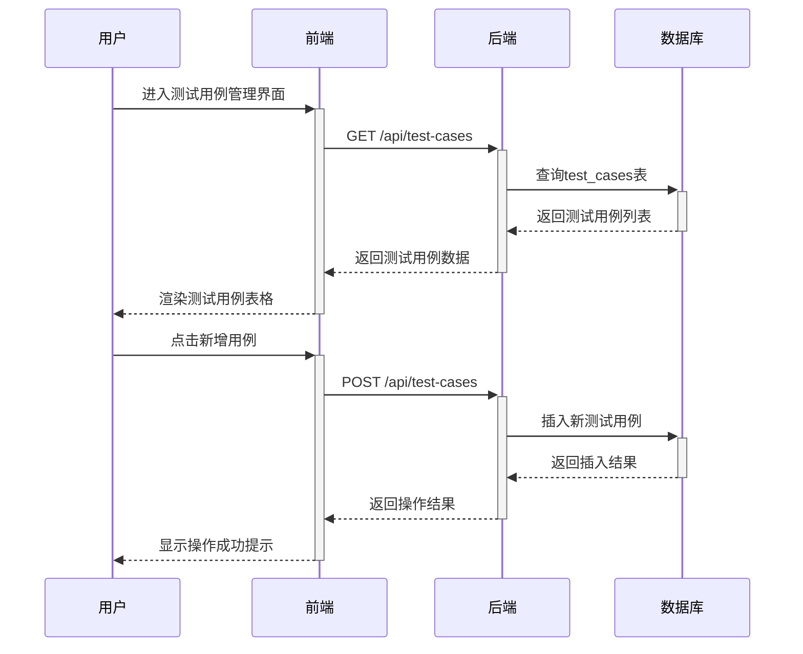
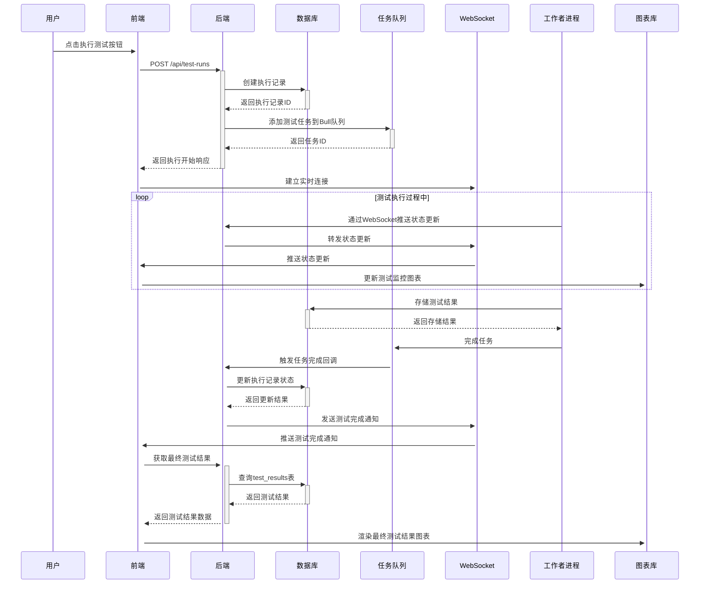

## 接口测试系统代码开发设计报告

### 一、系统概述

本报告旨在设计一个完整的接口测试系统，该系统将实现接口测试用例管理、测试执行监控及结果分析可视化等功能。系统采用前后端分离架构，前端基于Vue3+Element Plus+AntV技术栈实现用户界面，后端基于Node.js企业级框架node-eggs实现业务逻辑，数据库采用PostgreSQL存储测试数据。**该系统将支持功能测试、性能测试和安全测试等多种测试类型，并通过WebSocket实现实时数据展示，为用户提供直观的测试结果分析界面**。

### 二、技术选型

| 技术栈 | 选型 | 用途 |
|--------|------|------|
| 前端框架 | Vue3 + TypeScript | 提供响应式数据绑定和组件化开发能力 |
| UI组件库 | Element Plus | 提供丰富的表单、表格、弹窗等组件 |
| 可视化库 | AntV (G2Plot/G6) | 实现测试结果可视化展示 |
| 后端框架 | Node.js + node-eggs | 提供企业级Node.js应用开发能力 |
| 数据库 | PostgreSQL | 存储测试用例、执行记录和结果数据 |
| 实时通信 | WebSocket | 支持测试执行过程中的实时状态更新 |
| 任务队列 | Bull + Redis | 处理高并发性能测试任务 |
| API设计 | RESTful + OpenAPI规范 | 保证接口设计的标准化和可维护性 |

### 三、系统架构设计

#### 3.1 整体架构

系统采用典型的前后端分离架构，前端负责用户交互和数据展示，后端负责业务逻辑处理和数据存储，数据库负责持久化存储测试数据。

```mermaid
graph TD
    A[客户端] --> B{WebSocket/HTTP})
    B --> C[前端服务]
    C --> D[后端API]
    D --> E[数据库服务]
    D --> F[任务队列服务]
    D --> G[监控服务]
    E -->|PostgreSQL| H[测试用例表]
    E --> I[执行记录表]
    E --> J[结果表]
    F -->|Bull + Redis| K[测试任务队列]
    G --> L[Prometheus]
    G --> M[Grafana]
    G --> N[ELK]
```

#### 3.2 数据流设计

1. **测试用例管理数据流**：
   - 用户通过前端界面创建/编辑测试用例
   - 前端将用例数据通过REST API发送至后端
   - 后端验证数据并存储至PostgreSQL的test_cases表
   - 数据存储成功后返回结果至前端

2. **测试执行数据流**：
   - 用户通过前端界面触发测试执行
   - 前端发送测试请求至后端API
   - 后端将任务添加到Bull队列
   - 工作者进程从队列中取出任务执行
   - 执行过程中通过WebSocket向前端推送实时状态
   - 执行结果存储到PostgreSQL的test_runs和test_results表

3. **测试结果展示数据流**：
   - 用户通过前端界面查询测试结果
   - 前端发送查询请求至后端API
   - 后端从PostgreSQL查询结果数据
   - 后端返回数据至前端
   - 前端使用AntV图表库可视化展示数据

#### 3.3 核心交互流程

**测试用例管理流程**：



**测试执行监控流程**：



### 四、前端UI设计

#### 4.1 用户界面结构

系统前端包含三个核心功能模块：

1. **测试用例管理模块**：支持测试用例的创建、编辑、删除和查询
2. **测试执行监控模块**：支持测试任务的执行、监控和实时状态展示
3. **测试结果分析模块**：支持测试结果的查询、分析和可视化展示

#### 4.2 测试用例管理页面

**页面布局**：

```vue
<template>
  <div class="test-case管理工作台">
    <!-- 左侧环境配置和过滤区 -->
    <div class="左侧边栏" style="width: 25%; float: left;">
      <el-card shadow="hover" class="环境配置">
        <template #header>
          <div class="卡片标题">环境配置</div>
        </template>
        <el-row :gutter="20">
          <el-col :span="24">
            <el-select v-model="selectedEnvId" placeholder="选择测试环境" @change="loadCases">
              <el-option
                v-for="env in envList"
                :key="env.id"
                :label="env.name"
                :value="env.id">
              </el-option>
            </el-select>
          </el-col>
        </el-row>
      </el-card>

      <el-card shadow="hover" class="用例筛选">
        <template #header>
          <div class="卡片标题">用例筛选</div>
        </template>
        <el-row :gutter="20">
          <el-col :span="24">
            <el-input v-model="searchText" placeholder="输入接口名称或描述" @input="loadCases">
              <template #suffix>
                <el-icon><search /></el-icon>
              </template>
            </el-input>
          </el-col>
        </el-row>
      </el-card>
    </div>

    <!-- 右侧测试用例列表区 -->
    <div class="右侧内容" style="width: 70%; float: right; margin-left: 10px;">
      <el-card shadow="hover" class="操作工具栏">
        <template #header>
          <div class="卡片标题">测试用例管理</div>
        </template>
        <el-row :gutter="20">
          <el-col :span="24">
            <el-button type="primary" @click="handleCreateCase">新建用例</el-button>
            <el-button type="success" @click="handleRunSelectedCases">执行选中用例</el-button>
            <el-button type="warning" @click="handleBatchDeleteCases">批量删除</el-button>
          </el-col>
        </el-row>
      </el-card>

      <el-card shadow="hover" class="用例列表">
        <el-table
          :data="caseList"
          border
          stripe
          height="500"
          @selection-change="handleSelectionChange">
          <el-table-column type="selection" width="55"></el-table-column>
          <el-table-column prop="id" label="ID" width="80"></el-table-column>
          <el-table-column prop="name" label="用例名称" min-width="150"></el-table-column>
          <el-table-column prop="method" label="请求方法" width="100"></el-table-column>
          <el-table-column prop="url" label="接口地址" min-width="200"></el-table-column>
          <el-table-column prop=" creatorName" label="创建人" width="120"></el-table-column>
          <el-table-column prop="createdAt" label="创建时间" width="150"></el-table-column>
          <el-table-column label="操作" width="200">
            <template #default="scope">
              <el-button type="primary" @click="handleEditCase(scope.row)" size="small">编辑</el-button>
              <el-button type="success" @click="handleRunSingleCase(scope.row)" size="small">执行</el-button>
              <el-button type="danger" @click="handleDeleteCase(scope.row)" size="small">删除</el-button>
              <el-button type="info" @click="handleViewCase详情(scope.row)" size="small">详情</el-button>
            </template>
          </el-table-column>
        </el-table>

        <div class="分页容器" style="margin-top: 20px; text-align: right;">
          <el-pagination
            v-model:current-page="currentPage"
            v-model:page-size="pageSize"
            :total="total"
            :page-sizes="[10, 20, 30, 50]"
            layout="total, sizes, prev, link, next, ->,/jump"
            @size-change="handleSizeChange"
            @current-change="handleCurrentChange">
          </el-pagination>
        </div>
      </el-card>
    </div>
  </div>
</template>
```

**测试用例编辑组件**：

```vue
<template>
  <el-drawer v-model="isShowDrawer" title="编辑测试用例" size="70%" direction="rtl">
    <div class="抽屉内容">
      <el-steps :active="activeStep" finish态="finish" align-center>
        <el-step title="基础信息"></el-step>
        <el-step title="请求参数"></el-step>
        <el-step title="断言规则"></el-step>
        <el-step title="执行计划"></el-step>
      </el-steps>

      <div class="步骤内容" v-if="activeStep === 0">
        <!-- 基础信息表单 -->
        <DynamicForm :schema="baseInfoSchema" v-model="formModel"></DynamicForm>
      </div>

      <div class="步骤内容" v-if="activeStep === 1">
        <!-- 请求参数表单 -->
        <DynamicForm :schema="requestSchema" v-model="formModel"></DynamicForm>
      </div>

      <div class="步骤内容" v-if="activeStep === 2">
        <!-- 断言规则表单 -->
        <DynamicForm :schema="assertSchema" v-model="formModel"></DynamicForm>
      </div>

      <div class="步骤内容" v-if="activeStep === 3">
        <!-- 执行计划表单 -->
        <DynamicForm :schema="scheduleSchema" v-model="formModel"></DynamicForm>
      </div>

      <template #footer>
        <div class="抽屉底部操作">
          <el-button @click="prevStep">上一步</el-button>
          <el-button v-if="activeStep === 0" type="primary" @click="nextStep">下一步</el-button>
          <el-button v-else type="primary" @click="saveCase">保存</el-button>
        </div>
      </template>
    </div>
  </el-drawer>
</template>
```

#### 4.3 测试执行监控页面

**页面布局**：

```vue
<template>
  <div class="test-run监控台">
    <el-row :gutter="20">
      <el-col :span="6">
        <el-card shadow="hover" class="执行状态概览">
          <template #header>
            <div class="卡片标题">执行状态概览</div>
          </template>
          <div class="状态面板">
            <div class="状态项">
              <div class="状态值"> {{ runningTaskCount }} </div>
              <div class="状态标签">运行中任务</div>
            </div>
            <div class="状态项">
              <div class="状态值"> {{ successTaskCount }} </div>
              <div class="状态标签">已完成任务</div>
            </div>
            <div class="状态项">
              <div class="状态值"> {{ failedTaskCount }} </div>
              <div class="状态标签">失败任务</div>
            </div>
          </div>
        </el-card>
      </el-col>

      <el-col :span="6">
        <el-card shadow="hover" class="性能指标监控">
          <template #header>
            <div class="卡片标题">性能指标监控</div>
          </template>
          <div ref="performanceChartRef" style="height: 300px;"></div>
        </el-card>
      </el-col>

      <el-col :span="6">
        <el-card shadow="hover" class="接口拓扑图">
          <template #header>
            <div class="卡片标题">接口拓扑图</div>
          </template>
          <div ref="topologyChartRef" style="height: 300px;"></div>
        </el-card>
      </el-col>

      <el-col :span="6">
        <el-card shadow="hover" class="实时日志">
          <template #header>
            <div class="卡片标题">实时日志</div>
          </template>
          <el-input type="textarea" :rows="15" v-model="realTimeLog" :disabled="true"></el-input>
        </el-card>
      </el-col>
    </el-row>

    <el-row :gutter="20" style="margin-top: 20px;">
      <el-col :span="24">
        <el-card shadow="hover" class="任务列表">
          <template #header>
            <div class="卡片标题">测试任务列表</div>
          </template>
          <el-table
            :data="runList"
            border
            stripe
            height="500">
            <el-table-column prop="id" label="任务ID" width="120"></el-table-column>
            <el-table-column prop="caseName" label="测试用例" min-width="150"></el-table-column>
            <el-table-column prop="envName" label="测试环境" min-width="120"></el-table-column>
            <el-table-column prop="status" label="状态" width="100">
              <template #default="scope">
                <el-tag :type="statusTagType[scope.row.status]"> {{ scope.row.status }} </el-tag>
              </template>
            </el-table-column>
            <el-table-column prop="progress" label="进度" width="100">
              <template #default="scope">
                <el progress :percentage="scope.row.progress" :status="progressStatus[scope.row.status]"></el progress>
              </template>
            </el-table-column>
            <el-table-column prop="开始时间" label="开始时间" width="150"></el-table-column>
            <el-table-column prop="结束时间" label="结束时间" width="150"></el-table-column>
            <el-table-column prop="执行时长" label="执行时长" width="100"></el-table-column>
            <el-table-column label="操作" width="150">
              <template #default="scope">
                <el-button v-if="scope.row.status === 'RUNNING'" type="danger" @click="handleCancelRun scope.row)" size="small">取消</el-button>
                <el-button type="primary" @click="handle查看详情 scope.row)" size="small">详情</el-button>
              </template>
            </el-table-column>
          </el-table>
        </el-card>
      </el-col>
    </el-row>
  </div>
</template>
```

**实时图表组件**：

```vue
<template>
  <div ref="realTimeChartRef" class="实时图表容器"></div>
</template>

<script setup lang="ts">
import { ref, onMounted, onUnmounted, watch } from 'vue'
import type { Chart } from '@antv/g2plot'
import { useWebSocket } from '@vueuse/core'

const props = defineProps({
  runId: {
    type: String,
    required: true
  }
})

const realTimeChartRef = ref null
const chart = ref null as Ref<Chart | null>

// WebSocket连接
const { ready, ws, send } } = useWebSocket(`ws://localhost:7001/websocket/test-run/${props.runId}`)

// 监听WebSocket消息
watch(ready, (val) => {
  if (val) {
    ws.value.onmessage = (e) => {
      const data = JSON.parse(e.data)
      if (data.type === 'STATUS_UPDATE') {
        updateChart(data.data)
      }
    }
  }
})

// 更新图表数据
const updateChart = (newData) => {
  if (chart.value) {
    chart.value.appendData(newData)
  }
}

onMounted(() => {
  if (!realTimeChartRef.value) return
  chart.value = new Chart({
    container: realTimeChartRef.value,
    type: 'line',
    data: initialData,
    xField: 'timestamp',
    yField: 'responseTime',
    smooth: true,
    meta: {
      responseTime: {
        alias: '响应时间(ms)'
      }
    },
    interactions: [
      { type: 'brush' },
      { type: 'element活性' },
      { type: 'pan' },
      { type: 'zoom' }
    ]
  })
  chart.value.render()
})

onUnmounted(() => {
  if (chart.value) {
    chart.value.destroy()
  }
  if (ws.value) {
    ws.value.close()
  }
})
</script>
```

#### 4.4 测试结果分析页面

**页面布局**：

```vue
<template>
  <div class="testresult分析台">
    <el-row :gutter="20">
      <el-col :span="24">
        <el-card shadow="hover" class="结果查询条件">
          <template #header>
            <div class="卡片标题">结果查询条件</div>
          </template>
          <el-row :gutter="20">
            <el-col :span="6">
              <el-form-item label="测试任务ID">
                <el-input v-model="queryForm.runId" placeholder="输入任务ID查询"></el-input>
              </el-form-item>
            </el-col>

            <el-col :span="6">
              <el-form-item label="测试环境">
                <el-select v-model="queryForm.envId" placeholder="选择测试环境">
                  <el-option
                    v-for="env in envList"
                    :key="env.id"
                    :label="env.name"
                    :value="env.id">
                  </el-option>
                </el-select>
              </el-form-item>
            </el-col>

            <el-col :span="6">
              <el-form-item label="测试类型">
                <el-select v-model="queryForm.testType" placeholder="选择测试类型">
                  <el-option label="功能测试" value="function"></el-option>
                  <el-option label="性能测试" value="performance"></el-option>
                  <el-option label="安全测试" value="security"></el-option>
                </el-select>
              </el-form-item>
            </el-col>

            <el-col :span="6">
              <el-button type="primary" @click="handleQueryResults">查询结果</el-button>
            </el-col>
          </el-row>
        </el-card>
      </el-col>
    </el-row>

    <el-row :gutter="20" style="margin-top: 20px;">
      <el-col :span="12">
        <el-card shadow="hover" class="性能指标分析">
          <template #header>
            <div class="卡片标题">性能指标分析</div>
          </template>
          <div ref="performanceAnalysisChartRef" style="height: 400px;"></div>
        </el-card>
      </el-col>

      <el-col :span="12">
        <el-card shadow="hover" class="错误分布分析">
          <template #header>
            <div class="卡片标题">错误分布分析</div>
          </template>
          <div ref="errorDistributionChartRef" style="height: 400px;"></div>
        </el-card>
      </el-col>
    </el-row>

    <el-row :gutter="20" style="margin-top: 20px;">
      <el-col :span="24">
        <el-card shadow="hover" class="详细结果列表">
          <template #header>
            <div class="卡片标题">详细结果列表</div>
          </template>
          <el-table
            :data="detailedResults"
            border
            stripe
            height="500">
            <el-table-column prop="requestId" label="请求ID" width="120"></el-table-column>
            <el-table-column prop="interfaceName" label="接口名称" min-width="150"></el-table-column>
            <el-table-column prop="status" label="状态" width="100">
              <template #default="scope">
                <el-tag :type="statusTagType[scope.row.status]"> {{ scope.row.status }} </el-tag>
              </template>
            </el-table-column>
            <el-table-column prop="responseTime" label="响应时间(ms)" width="120"></el-table-column>
            <el-table-column prop="Http状态码" label="HTTP状态码" width="100"></el-table-column>
            <el-table-column prop="错误信息" label="错误信息" min-width="200"></el-table-column>
            <el-table-column prop="执行时间" label="执行时间" width="150"></el-table-column>
          </el-table>
        </el-card>
      </el-col>
    </el-row>
  </div>
</template>
```

**动态图表组件**：

```vue
<template>
  <div ref="chartRef" :style="{ height: chartHeight + 'px' }"></div>
</template>

<script setup lang="ts">
import { ref, onMounted, onUnmounted, watch } from 'vue'
import type { Chart } from '@antv/g2plot'
import { useRoute } from 'vue-router'

const props = defineProps({
  chartType: {
    type: String,
    required: true,
    validator: (value) => ['line', 'bar', 'pie', 'radar'].includes(value)
  },
  chartData: {
    type: Array as PropType任何对象[]>,
    required: true
  },
  chartHeight: {
    type: Number,
    default: 400
  }
})

const chartRef = ref(null)
const chart = ref(null) as Ref<Chart | null>

onMounted(() => {
  if (!chartRef.value) return
  // 根据不同图表类型创建对应图表
  if (props chartType === 'line') {
    chart.value = new Chart({
      container: chartRef.value,
      type: 'line',
      data: props chartData,
      xField: 'timestamp',
      yField: 'value',
      seriesField: 'metric',
      smooth: true,
      meta: {
        timestamp: {
          alias: '时间'
        },
        value: {
          alias: '数值'
        }
      }
    })
  } else if (props chartType === 'bar') {
    // 其他图表类型创建逻辑...
  }
  chart.value.render()
})

watch(() => props chartData, (newData) => {
  if (chart.value) {
    chart.value.appendData(newData)
  }
})

onUnmounted(() => {
  if (chart.value) {
    chart.value.destroy()
  }
})
</script>
```

### 四、后端架构设计

#### 4.1 项目目录结构

```
 egg-test-system/
 ├── app/
 │   ├── controller/      # 控制器层
 │   ├── service/        # 服务层
 │   ├── model/         # 数据模型层
 │   ├── job/          # 定时任务
 │   ├── queue/        # 任务队列
 │   ├── socket/       # WebSocket服务
 │   └── ...
 ├── config/
 │   ├── config.default.js  # 默认配置
 │   ├── config local.js    # 开发环境配置
 │   ├── config.prod.js     # 生产环境配置
 │   └── ...
 ├── package.json
 ├── Dockerfile
 └── ...
```

#### 4.2 核心模块设计

##### 4.2.1 接口测试服务模块

```javascript
// app/service/testService.js
module.exports = app => {
  class TestService extends app Service {
    // 创建测试用例
    async createTestCase(params) {
      // 验证参数
      const { name, method, url, requestBody, headers, assertRules } = params
      if (!name || !method || !url) {
        throw new app.错误('缺少必要参数')
      }

      // 构建数据库插入数据
      const data = {
        name,
        method,
        url,
        request_body: JSON.stringify(requestBody),
        headers: JSON.stringify(headers),
        assert_rules: JSON.stringifyassertRules),
        created_at: new Date(),
        updated_at: new Date()
      }

      try {
        // 插入数据库
        const result = await app.model.TestCase.create(data)
        return result
      } catch (err) {
        console.error('创建测试用例失败:', err)
        throw new app.错误('创建测试用例失败')
      }
    }

    // 获取测试用例列表
    async getTestCaseList({ envId, searchKey, page, size }) {
      // 构建查询条件
      const where = {}
      if (envId) {
        where.env_id = envId
      }
      if (searchKey) {
        where.$or = [
          { name: { $like: `%${searchKey}%` } },
          { url: { $like: `%${searchKey}%` } }
        ]
      }

      // 查询数据库
      const [cases, total] = await app.model.TestCase.findAndCountAll({
        where,
        offset: (page - 1) * size,
        limit: size,
        order: [['created_at', 'DESC']]
      })

      // 转换为前端可读格式
      const formattedCases = cases.map(case => ({
        ...case.dataValues,
        status: case.status === 'enabled' ? '启用' : '禁用'
      }))

      return {
        data: formattedCases,
        total,
        page,
        size
      }
    }

    // 执行测试任务
    async runTestTask(params) {
      // 验证参数
      const { caseId, envId, concurrency } = params
      if (!caseId || !envId) {
        throw new app.错误('缺少必要参数')
      }

      // 获取测试用例和环境配置
      const [testCase, envConfig] = await Promise.all([
        app.model.TestCase.findByPk(caseId),
        app.model.envConfig.findByPk(envId)
      ])

      if (!testCase || !envConfig) {
        throw new app.错误('测试用例或环境配置不存在')
      }

      // 构建完整的测试请求
      const fullUrl = envConfig.base_url +in case.url
      let headers = {}
      if (envConfig.headers) {
        headers = JSON.parse(envConfig.headers)
      }
      if (testCase.headers) {
        headers = { ...headers, ...JSON.parse(testCase.headers) }
      }

      let body = {}
      if (testCase.request_body) {
        body = JSON.parse(testCase.request_body)
      }

      // 构建测试任务数据
      const runData = {
        case_id:in caseId,
        env_id:in envId,
        status: 'RUNNING',
        start_time: new Date(),
        concurrency: concurrency || 1
      }

      // 创建执行记录
      const testRun = await app.model.TestRun.create(runData)

      // 构建测试任务参数
      const taskParams = {
        runId: testRun.id,
        url: fullUrl,
        method:in case.method,
        headers,
        body,
        concurrency: runData.concurrency
      }

      // 将任务添加到Bull队列
      await app.bull队列.add('testRun', taskParams)

      return testRun
    }
  }

  return TestService
}
```

##### 4.2.2 WebSocket服务模块

```javascript
// app/socker/testRun.js
module.exports = app => {
  const { socket } = app

  // 监听测试任务状态更新
  socket.on('testRunStatusUpdate', async (data) => {
    // 获取测试任务
    const testRun = await app.model.TestRun.findByPk(data.runId)

    if (!testRun) {
      console.error('测试任务不存在:', data.runId)
      return
    }

    // 更新测试任务状态
    await testRun.update({
      status: data.status,
      progress: data.progress,
      end_time: data.status === 'SUCCESS' || data.status === 'FAILED' ? new Date() : null
    })

    // 获取所有订阅该任务的客户端
    const clients = app.io.of('/test-run').sockets
      .filter(client => client.data.runId === data.runId)

    // 向所有客户端推送更新
    clients.forEach(client => {
      client emit('statusUpdate', data)
    })
  })
}
```

##### 4.2.3 任务队列模块

```javascript
// app/queue/testRun.js
module.exports = app => {
  const { bull } = app

  bull队列.process('testRun', async (job) => {
    const { runId, url, method, headers, body, concurrency } = job.data

    // 创建测试结果存储器
    const results = []

    // 使用async库实现并发控制
    const tasks = concurrency ? concurrency : 1
    const queue = bull队列.createQueue('testRequests', { concurrency: tasks })

    // 添加测试请求任务
    for (let i = 0; i < totalRequests; i++) {
      queue.add('testRequest', {
        runId,
        url,
        method,
        headers,
        body
      })
    }

    // 监听队列完成
    queue.on('完成', async (job) => {
      // 获取测试任务
      const testRun = await app.model.TestRun.findByPk(runId)

      if (!testRun) {
        console.error('测试任务不存在:', runId)
        return
      }

      // 更新测试任务进度
      const progress = (job.completionCount / totalRequests) * 100
      await testRun.update({ progress: Math.round(progress) })

      // 通过WebSocket推送更新
      app.io.of('/test-run').emit('statusUpdate', {
        runId,
        status: testRun.status,
        progress: Math.round(progress),
        timestamp: new Date().toISOString()
      })
    })

    // 等待所有测试请求完成
    await queue.empty()

    // 更新测试任务状态
    await app.model.TestRun.update({
      status: 'SUCCESS',
      end_time: new Date()
    }, {
      where: { id: runId }
    })

    // 通过WebSocket推送最终状态
    app.io.of('/test-run').emit('statusUpdate', {
      runId,
      status: 'SUCCESS',
      progress: 100,
      timestamp: new Date().toISOString()
    })
  })
}
```

#### 4.3 API设计

##### 4.3.1 测试用例管理API

```javascript
// appi i控制器
module.exports = app => {
  class TestCasesController extends app Controller {
    // 获取测试用例列表
    async index() {
      const { page = 1, size = 10, envId, searchKey } = this ctx.query
      const result = await this.app.service.TestService.getTestCaseList({
        envId,
        searchKey,
        page: Number(page),
        size: Number(size)
      })
      this ctx.body = {
        code: 200,
        data: result,
        message: '获取测试用例成功'
      }
    }

    // 创建测试用例
    async create() {
      try {
        const result = await this.app.service.TestService.createTestCase(this ctx.request.body)
        this ctx.body = {
          code: 201,
          data: result,
          message: '创建测试用例成功'
        }
      } catch (err) {
        this.ctx.body = {
          code: 500,
          data: null,
          message: '创建测试用例失败',
          error: err.message
        }
      }
    }

    // 执行测试用例
    async run() {
      try {
        const { caseId, envId, concurrency } = this ctx.request.body
        const result = await this.app.service.TestService.runTestTask({
          caseId,
          envId,
          concurrency
        })
        this.ctx.body = {
          code: 200,
          data: result,
          message: '测试任务已提交'
        }
      } catch (err) {
        this.ctx.body = {
          code: 500,
          data: null,
          message: '提交测试任务失败',
          error: err.message
        }
      }
    }
  }

  return TestCasesController
}
```

##### 4.3.2 测试结果查询API

```javascript
// appi i控制器
module.exports = app => {
  class TestResultsController extends app Controller {
    // 获取测试结果列表
    async list() {
      const { runId, type = 'function', page = 1, size = 10 } = this ctx.query
      const where = { run_id: runId }

      if (type === 'performance') {
        // 查询性能结果
        const results = await this.app.modelPerfResult.findall({
          where,
          offset: (page - 1) * size,
          limit: size,
          order: [['timestamp', 'ASC']]
        })

        this.ctx.body = {
          code: 200,
          data: results,
          message: '获取性能测试结果成功'
        }
      } else {
        // 查询功能结果
        const results = await this.app.model的功能结果.findall({
          where,
          offset: (page - 1) * size,
          limit: size,
          order: [['timestamp', 'ASC']]
        })

        this.ctx.body = {
          code: 200,
          data: results,
          message: '获取功能测试结果成功'
        }
      }
    }

    // 获取测试结果统计
    async stats() {
      const { runId, type = 'function' } = this ctx.query
      const where = { run_id: runId }

      let stats = {}
      if (type === 'performance') {
        // 查询性能统计
        stats = await this.app.service.TestService.getPerfStats(runId)
      } else {
        // 查询功能统计
        stats = await this.app.service.TestService.getFuncStats(runId)
      }

      this.ctx.body = {
        code: 200,
        data: stats,
        message: '获取测试结果统计成功'
      }
    }
  }

  return TestResultsController
}
```

### 五、数据库设计

#### 5.1 核心表结构

##### 5.1.1 测试用例表 (test_cases)

```sql
CREATE TABLE test_cases (
  id SERIAL PRIMARY KEY,
  name VARCHAR(255) NOT NULL,
  description TEXT,
  method VARCHAR(10) NOT NULL CHECK (method IN ('GET', 'POST', 'PUT', 'DELETE', 'PATCH', 'HEAD', 'OPTIONS')),
  url VARCHAR(1024) NOT NULL,
  request_body JSONB,
  headers JSONB,
  assert_rules JSONB,
  env_config_id INT REFERENCES env_configs(id),
  project_id INT REFERENCES projects(id),
  status VARCHAR(10) DEFAULT 'enabled' CHECK (status IN ('enabled', 'disabled')),
  created_by INT REFERENCES users(id),
  updated_by INT REFERENCES users(id),
  created_at TIMESTAMP DEFAULT CURRENT_TIMESTAMP,
  updated_at TIMESTAMP DEFAULT CURRENT_TIMESTAMP
);

-- 创建索引
CREATE INDEX idx_test_cases_name ON test_cases(name);
CREATE INDEX idx_test_cases_method ON test_cases(method);
CREATE INDEX idx_test_cases_env_config_id ON test_cases(env_config_id);
CREATE INDEX idx_test_cases_project_id ON test_cases(project_id);
CREATE INDEX idx_test_cases_status ON test_cases(status);
CREATE INDEX idx_test_cases assert_rules ON test_casesUSING GIN assert_rules);

-- 添加注释
COMMENT ON TABLE test_cases IS '测试用例表';
COMMENT ON COLUMN test_cases.id IS '测试用例ID';
COMMENT ON COLUMN test_cases.name IS '测试用例名称';
COMMENT ON COLUMN test_cases.description IS '测试用例描述';
COMMENT ON COLUMN test_cases.method IS 'HTTP方法';
COMMENT ON COLUMN test_cases.url IS '接口URL';
COMMENT ON COLUMN test_cases.request_body IS '请求体模板';
COMMENT ON COLUMN test_cases.headers IS '请求头模板';
COMMENT ON COLUMN test_cases assert_rules IS '断言规则';
COMMENT ON COLUMN test_cases.env_config_id IS '环境配置ID';
COMMENT ON COLUMN test_casesproject_id IS '项目ID';
COMMENT ON COLUMN test_cases.status IS '用例状态';
COMMENT ON COLUMN test_casescreated_by IS '创建人';
COMMENT ON COLUMN test_casesupdated_by IS '更新人';
COMMENT ON COLUMN test_casescreated_at IS '创建时间';
COMMENT ON COLUMN test_casesupdated_at IS '更新时间';
```

##### 5.1.2 测试环境配置表 (env_configs)

```sql
CREATE TABLE env_configs (
  id SERIAL PRIMARY KEY,
  name VARCHAR(255) NOT NULL,
  description TEXT,
  base_url VARCHAR(1024) NOT NULL,
  headers_template JSONB,
  variables JSONB,
  created_by INT REFERENCES users(id),
  updated_by INT REFERENCES users(id),
  created_at TIMESTAMP DEFAULT CURRENT_TIMESTAMP,
  updated_at TIMESTAMP DEFAULT CURRENT_TIMESTAMP
);

-- 创建索引
CREATE INDEX idx_env_configs_name ON env_configs(name);
CREATE INDEX idx_env_configs_base_url ON env_configs(base_url);
CREATE INDEX idx_env_configs created_by ON env_configs created_by);

-- 添加注释
COMMENT ON TABLE env_configs IS '测试环境配置表';
COMMENT ON COLUMN env_configs.id IS '环境配置ID';
COMMENT ON COLUMN env_configs.name IS '环境名称';
COMMENT ON COLUMN env_configs.description IS '环境描述';
COMMENT ON COLUMN env_configs.base_url IS '基础URL';
COMMENT ON COLUMN env_configs.headers_template IS '公共Header模板';
COMMENT ON COLUMN env_configs(variables IS '环境变量';
COMMENT ON COLUMN env_configscreated_by IS '创建人';
COMMENT ON COLUMN env_configsupdated_by IS '更新人';
COMMENT ON COLUMN env_configscreated_at IS '创建时间';
COMMENT ON COLUMN env_configsupdated_at IS '更新时间';
```

##### 5.1.3 测试执行记录表 (test_runs)

```sql
CREATE TABLE test_runs (
  id SERIAL PRIMARY KEY,
  case_id INT REFERENCES test_cases(id),
  env_id INT REFERENCES env_configs(id),
  status VARCHAR(10) NOT NULL DEFAULT 'PENDING' CHECK (status IN ('PENDING', 'RUNNING', 'SUCCESS', 'FAILED')),
  start_time TIMESTAMP,
  end_time TIMESTAMP,
  progress FLOAT DEFAULT 0.0,
  concurrency INT DEFAULT 1,
  total_requests INT,
  success_requests INT,
  error_requests INT,
  created_by INT REFERENCES users(id),
  created_at TIMESTAMP DEFAULT CURRENT_TIMESTAMP,
  updated_at TIMESTAMP DEFAULT CURRENT_TIMESTAMP
);

-- 创建索引
CREATE INDEX idx_test_runs_case_id ON test_runs(case_id);
CREATE INDEX idx_test_runs_env_id ON test_runs(env_id);
CREATE INDEX idx_test_runs_status ON test_runs(status);
CREATE INDEX idx_test_runs_start_time ON test_runs(start_time);
CREATE INDEX idx_test_runs_end_time ON test_runs(end_time);
CREATE INDEX idx_test_runs_created_by ON test_runs(created_by);

-- 添加注释
COMMENT ON TABLE test_runs IS '测试执行记录表';
COMMENT ON COLUMN test_runs.id IS '测试执行记录ID';
COMMENT ON COLUMN test_runs.case_id IS '测试用例ID';
COMMENT ON COLUMN test_runs.env_id IS '环境配置ID';
COMMENT ON COLUMN test_runs.status IS '执行状态';
COMMENT ON COLUMN test_runs.start_time IS '开始时间';
COMMENT ON COLUMN test_runs.end_time IS '结束时间';
COMMENT ON COLUMN test_runs.progress IS '执行进度百分比';
COMMENT ON COLUMN test_runs.concurrency IS '并发数';
COMMENT ON COLUMN test_runs.total_requests IS '总请求数';
COMMENT ON COLUMN test_runs.success_requests IS '成功请求数';
COMMENT ON COLUMN test_runs.error_requests IS '错误请求数';
COMMENT ON COLUMN test_runscreated_by IS '创建人';
COMMENT ON COLUMN test_runscreated_at IS '创建时间';
COMMENT ON COLUMN test_runsupdated_at IS '更新时间';
```

##### 5.1.4 功能测试结果表 (func_results)

```sql
CREATE TABLE func_results (
  id SERIAL PRIMARY KEY,
  run_id INT REFERENCES test_runs(id),
  interface_name VARCHAR(255),
  status VARCHAR(10) NOT NULL CHECK (status IN ('SUCCESS', 'FAILED')),
  response_time INT,  -- 毫秒
  http_status_code INT,
  response JSONB,
  error_message TEXT,
  timestamp TIMESTAMP DEFAULT CURRENT_TIMESTAMP,
  created_at TIMESTAMP DEFAULT CURRENT_TIMESTAMP
);

-- 创建索引
CREATE INDEX idx_func_results_run_id ON func_results(run_id);
CREATE INDEX idx_func_results_status ON func_results(status);
CREATE INDEX idx_func_results_timestamp ON func_results(timestamp);
CREATE INDEX idx_func_results Interface_name ON func_resultsUSING哈希(interface_name);

-- 添加注释
COMMENT ON TABLE func_results IS '功能测试结果表';
COMMENT ON COLUMN func_results.id IS '功能测试结果ID';
COMMENT ON COLUMN func_results.run_id IS '测试执行记录ID';
COMMENT ON COLUMN func_results Interface_name IS '接口名称';
COMMENT ON COLUMN func_results.status IS '测试状态';
COMMENT ON COLUMN func_results response_time IS '响应时间(毫秒)';
COMMENT ON COLUMN func_results http_status_code IS 'HTTP状态码';
COMMENT ON COLUMN func_results response IS '响应内容';
COMMENT ON COLUMN func_results error_message IS '错误信息';
COMMENT ON COLUMN func_results timestamp IS '测试时间戳';
COMMENT ON COLUMN func_resultscreated_at IS '创建时间';
```

##### 5.1.5 性能测试结果表 (perf_results)

```sql
CREATE TABLE perf_results (
  id SERIAL PRIMARY KEY,
  run_id INT REFERENCES test_runs(id),
  tps FLOAT,  -- 每秒请求数
  avg_response_time INT,  -- 平均响应时间(毫秒)
  p95_response_time INT,  -- 95%分位响应时间(毫秒)
  error_rate FLOAT,  -- 错误率
  timestamp TIMESTAMP DEFAULT CURRENT_TIMESTAMP,
  created_at TIMESTAMP DEFAULT CURRENT_TIMESTAMP
);

-- 创建索引
CREATE INDEX idx_perf_results_run_id ON perf_results(run_id);
CREATE INDEX idx_perf_results_timestamp ON perf_results(timestamp);

-- 添加注释
COMMENT ON TABLE perf_results IS '性能测试结果表';
COMMENT ON COLUMN perf_results.id IS '性能测试结果ID';
COMMENT ON COLUMN perf_results.run_id IS '测试执行记录ID';
COMMENT ON COLUMN perf_results.tps IS '每秒请求数';
COMMENT ON COLUMN perf_results avg_response_time IS '平均响应时间(毫秒)';
COMMENT ON COLUMN perf_results p95_response_time IS '95%分位响应时间(毫秒)';
COMMENT ON COLUMN perf_results error_rate IS '错误率';
COMMENT ON COLUMN perf_results timestamp IS '测试时间戳';
COMMENT ON COLUMN perf_resultscreated_at IS '创建时间';
```

#### 5.2 数据库优化策略

1. **索引优化**：
   - 对高频查询字段（如`test_runs.run_id`、`func_results interface_name`）使用B-tree索引
   - 对JSONB字段（如`test_cases assert_rules`）使用GIN索引加速查询
   - 对时间戳字段（如`test_runs.start_time`）使用BRIN索引优化范围查询

2. **分区表策略**：
   - 对`func_results`表按测试执行记录ID分区，提高查询效率
   - 对`perf_results`表按时间分区，便于历史数据分析

3. **连接池配置**：
   ```javascript
   // config/config.default.js
   module.exports = {
     // ...
     sequencer: {
       dialect: 'postgres',
       pool: {
         max: 10,      // 最大连接数
         min: 0,       // 最小空闲连接数
         idle: 10000, // 连接空闲超时时间
         acquire: 30000, // 获取连接超时时间
         remove: 15000 // 连接移除超时时间
       }
     }
   }
   ```

4. **批量写入优化**：
   - 使用`pg-pool`的批量写入功能，减少数据库连接开销
   - 使用`UPSERT`语句处理可能的重复数据
   - 使用事务确保数据一致性

### 六、AI Agent集成设计

#### 6.1 AI Agent功能需求

系统可集成以下AI Agent以提升测试效率和质量：

1. **测试用例自动生成Agent**：
   - 功能：基于接口文档自动生成测试用例
   - 触发方式：用户上传OpenAPI/Swagger文档后自动触发
   - 输入：接口文档（JSON/YAML格式）
   - 输出：包含正常/边界/异常参数的测试用例集合

2. **性能瓶颈预测Agent**：
   - 功能：分析历史性能数据，预测系统性能瓶颈
   - 触发方式：性能测试完成后自动触发
   - 输入：性能测试结果数据（TPS、响应时间、错误率等）
   - 输出：性能瓶颈预测报告和优化建议

3. **测试结果智能分析Agent**：
   - 功能：自动分析测试结果，识别潜在问题
   - 触发方式：测试任务完成时自动触发
   - 输入：测试结果数据
   - 输出：问题分类（如性能问题、功能缺陷、安全漏洞）和优先级排序

#### 6.2 AI Agent集成方案

1. **测试用例自动生成Agent集成**：
   ```javascript
   // appi i控制器
   module.exports = app => {
     class AutoTestCasesController extends app Controller {
       // 生成测试用例
       async generate() {
         try {
           const { spec } = this ctx.request.body  // 接口文档
           // 调用AI Agent生成测试用例
           const testCases = await callAI generateTestCases(spec)
           this.ctx.body = {
             code: 200,
             data: testCases,
             message: '测试用例生成成功'
           }
         } catch (err) {
           this.ctx.body = {
             code: 500,
             data: null,
             message: '测试用例生成失败',
             error: err.message
           }
         }
       }
     }

     return AutoTestCasesController
   }
   ```

2. **性能瓶颈预测Agent集成**：
   ```javascript
   // appi i控制器
   module.exports = app => {
     class PerfAnalysisController extends app Controller {
       // 分析性能瓶颈
       async analyze() {
         try {
           const { runId } = this ctx.query
           // 从数据库获取性能数据
           const perfData = await this.app.modelPerfResult.findall({
             where: { run_id: runId }
           })

           // 调用AI Agent进行分析
           const analysisResult = await callAI analyzePerfBottleneck(perfData)

           this.ctx.body = {
             code: 200,
             data: analysisResult,
             message: '性能分析完成'
           }
         } catch (err) {
           this.ctx.body = {
             code: 500,
             data: null,
             message: '性能分析失败',
             error: err.message
           }
         }
       }
     }

     return PerfAnalysisController
   }
   ```

### 七、开发设计方案

#### 7.1 前端开发步骤

##### 7.1.1 环境配置与依赖安装

1. **安装必要依赖**：
   ```bash
   npm install element-plus @antv/g2plot @antv/x6
   ```

2. **配置Vite环境**：
   ```javascript
   // vite.config.js
   import { defineConfig } from 'vite'
   import vue from '@vitejs/plugin-vue'

   export default defineConfig({
     plugins: [vue()],
     define: {
       'VITE_API_BASE_URL': `"http://localhost:7001/api"`
     }
   })
   ```

3. **封装全局组件**：
   ```javascript
   // main.js
   import { createApp } from 'vue'
   import App from './App.vue'
   import ElementPlus from 'element-plus'
   import 'element-plus/dist/index.css'
   import * as G2Plot from '@antv/g2plot'
   import * as X6 from '@antv/x6'

   const app = createApp(App)

   app.use(ElementPlus)
   // 注册全局图表组件
   app.component('LineChart', G2PlotLine)
   app.component('BarChart', G2PlotBar)
   // 注册全局WebSocket服务
   app provide('websocket', createWebSocketService())

   app.mount('#app')
   ```

##### 7.1.2 测试用例管理页面开发

1. **创建动态表单组件**：
   ```vue
   <!-- components/DynamicForm.vue -->
   <template>
     <el-form ref="formRef" :model="formData" :rules="formRules">
       <template v-for="field in formSchema" :key="field.name">
         <el-form-item
           v-if="!field隐藏"
           :label="field label"
           :prop="field.name"
           :rules="field rules"
         >
           <!-- 根据字段类型渲染不同组件 -->
           <el-input v-if="field.type === 'input'" v-model="formData(field.name)"></el-input>
           <el-select v-else-if="field.type === 'select'" v-model="formData(field.name)" :options="field.options">
             <template #suffix>
               <el-icon v-if="field.type === 'select'" class="el-input__suffix-icon">
                 <arrow-down />
               </el-icon>
             </template>
           </el-select>
           <!-- 其他组件类型... -->
         </el-form-item>
       </template>
     </el-form>
   </template>

   <script setup lang="ts">
   import type { FormSchema, FormItem } from './types'

   const props = defineProps({
     schema: {
       type: Object as PropType any object[]>,
       required: true
     }
   })

   const formData = ref任何对象({})

   // 初始化表单数据
   onMounted(() => {
     props schema.forEach(field => {
       formData.value[field.name] = field defaultValue || ''
     })
   })
   </script>
   ```

2. **实现测试用例编辑功能**：
   ```vue
   <!-- views/TestCasesEdit.vue -->
   <template>
     <div class="test-case编辑界面">
       <el-steps :active="activeStep" finish态="finish" align-center>
         <el-step title="基础信息"></el-step>
         <el-step title="请求参数"></el-step>
         <el-step title="断言规则"></el-step>
         <el-step title="执行计划"></el-step>
       </el-steps>

       <div class="步骤内容" v-if="activeStep === 0">
         <!-- 基础信息表单 -->
         <DynamicForm :schema="baseInfoSchema" v-model="formModel"></DynamicForm>
       </div>

       <!-- 其他步骤内容... -->
     </div>
   </template>

   <script setup lang="ts">
   import type { FormSchema } from '@/components/DynamicForm'

   // 定义不同步骤的表单配置
   const baseInfoSchema = ref any object>([
     {
       name: 'name',
       label: '用例名称',
       type: 'input',
       rules: [{ required: true, message: '请输入用例名称', trigger: 'blur' }]
     },
     // 其他字段...
   ])

   // 定义表单数据模型
   const formModel = ref({
     name: '',
     method: 'GET',
     url: '',
     // 其他字段...
   })

   // 提交表单
   const提交表单 = async () => {
     try {
       await api.createTestCase(formModel.value)
       ElMessage.success('测试用例创建成功')
       router.push('/test-cases')
     } catch (err) {
       ElMessage.error('创建失败: ' + err.message)
     }
   }
   </script>
   ```

##### 7.1.3 测试执行监控页面开发

1. **创建WebSocket服务封装**：
   ```javascript
   // src/services/WebSocketService.js
   import { ref, onMounted, onUnmounted } from 'vue'

   export default function createWebSocketService() {
     const ws = ref(null)
     const ready = ref(false)
     const messages = ref([])

     onMounted(() => {
       connect()
     })

     function connect() {
       if (!ws.value) {
         ws.value = new WebSocket('ws://localhost:7001/websocket/test-run')
         ws.value.onopen = () => {
           ready.value = true
         }
         ws.value.onmessage = (e) => {
           const data = JSON.parse(e.data)
           messages.value.push(data)
         }
         ws.value.onclose = () => {
           ready.value = false
         }
         ws.value.onerror = (err) => {
           console.error('WebSocket连接错误:', err)
         }
       }
     }

     function disconnect() {
       if (ws.value) {
         ws.value.close()
         ws.value = null
         ready.value = false
       }
     }

     return {
       ws,
       ready,
       messages,
       connect,
       disconnect
     }
   }
   ```

2. **实现实时监控图表**：
   ```vue
   <!-- components/RealTimeChart.vue -->
   <template>
     <div ref="chartRef" class="实时图表容器"></div>
   </template>

   <script setup lang="ts">
   import { ref, onMounted, onUnmounted, watch } from 'vue'
   import type { Chart } from '@antv/g2plot'
   import { useWebSocket } from '@/services/WebSocketService'

   const props = defineProps({
     runId: {
       type: String,
       required: true
     }
   })

   const chartRef = ref(null)
   const chart = ref(null) as Ref<Chart | null>
   const webSocketService = useWebSocket()

   // 监听WebSocket消息
   watch(() => webSocketService messages, (newMessages) => {
     const relevantMessages = newMessages.filter(msg => msg.runId === props.runId)
     if (chart.value) {
       chart.value.appendData(relevantMessages)
     }
   })

   onMounted(() => {
     if (!chartRef.value) return
     // 创建折线图展示响应时间
     chart.value = new Chart({
       container: chartRef.value,
       type: 'line',
       data: [],
       xField: 'timestamp',
       yField: 'responseTime',
       smooth: true,
       meta: {
         responseTime: {
           alias: '响应时间(ms)'
         }
       }
     })
     chart.value.render()
   })

   onUnmounted(() => {
     if (chart.value) {
       chart.value.destroy()
     }
     webSocketService disconnect()
   })
   </script>
   ```

##### 7.1.4 测试结果分析页面开发

1. **创建图表工厂组件**：
   ```javascript
   // src/services/ChartFactory.js
   import * as G2Plot from '@antv/g2plot'

   export default {
     createLineChart: (container, data) => {
       return new G2PlotLine({
         container,
         data,
         xField: 'timestamp',
         yField: 'value',
         seriesField: 'metric',
         smooth: true,
         meta: {
           timestamp: {
             alias: '时间'
           },
           value: {
             alias: '数值'
           }
         }
       })
     },

     createBarChart: (container, data) => {
       return new G2PlotBar({
         container,
         data,
         xField: 'interface',
         yField: 'successRate',
         colorField: 'status',
         isStacked: true,
         meta: {
           successRate: {
             alias: '成功率',
             min: 0,
             max: 100
           }
         }
       })
     },

     // 其他图表类型...
   }
   ```

2. **实现结果分析功能**：
   ```vue
   <!-- views/TestResultsAnalysis.vue -->
   <template>
     <div class="testresult分析界面">
       <el-row :gutter="20">
         <el-col :span="24">
           <el-card shadow="hover" class="性能指标分析">
             <template #header>
               <div class="卡片标题">性能指标分析</div>
             </template>
             <div ref="performanceChartRef" class="图表容器"></div>
           </el-card>
         </el-col>
       </el-row>

       <el-row :gutter="20" style="margin-top: 20px;">
         <el-col :span="24">
           <el-card shadow="hover" class="错误分布分析">
             <template #header>
               <div class="卡片标题">错误分布分析</div>
             </template>
             <div ref="errorChartRef" class="图表容器"></div>
           </el-card>
         </el-col>
       </el-row>
     </div>
   </template>

   <script setup lang="ts">
   import { ref, onMounted, onUnmounted } from 'vue'
   import { useRoute } from 'vue-router'
   import { useChartFactory } from '@/services/ChartFactory'
   import { useAPICalls } from '@/services/APICalls'

   const route = useRoute()
   const chartFactory = useChartFactory()
   const api = useAPICalls()

   const performanceChartRef = ref(null)
   const errorChartRef = ref(null)
   const performanceChart = ref(null)
   const errorChart = ref(null)

   const runId = route.params.runId as string

   // 加载性能数据
   const loadPerfData = async () => {
     const data = await api.getTestResults({
       runId,
       type: 'performance'
     })
     if (performanceChart.value) {
       performanceChart.value.appendData(data)
     }
   }

   // 加载错误数据
   const载入错误数据 = async () => {
     const data = await api.getTestResults({
       runId,
       type: 'function',
       filter: { status: 'FAILED' }
     })
     if (errorChart.value) {
       errorChart.value.appendData(data)
     }
   }

   onMounted(() => {
     // 加载数据
     loadPerfData()
     loadErrorData()

     // 创建性能图表
     performanceChart.value = chartFactory.createLineChart(performanceChartRef.value, [])
     performanceChart.value.render()

     // 创建错误图表
     errorChart.value = chartFactory.createPieChart(errorChartRef.value, [])
     errorChart.value.render()
   })

   onUnmounted(() => {
     // 销毁图表
     if (performanceChart.value) {
       performanceChart.value.destroy()
     }
     if (errorChart.value) {
       errorChart.value.destroy()
     }
   })
   </script>
   ```

#### 7.2 后端开发步骤

##### 7.2.1 项目初始化与环境配置

1. **初始化node-eggs项目**：
   ```bash
   npm init egg --type=simple
   cd egg-test-system
   npm install
   ```

2. **配置PostgreSQL数据库**：
   ```javascript
   // config/config.default.js
   module.exports = {
     sequencer: {
       dialect: 'postgres',
       database: 'egg_test',
       host: '127.0.0.1',
       port: 5432,
       username: 'test',
       password: 'test',
       pool: {
         max: 10,
         min: 0,
         idle: 10000
       }
     }
   }
   ```

3. **配置Redis与Bull队列**：
   ```javascript
   // config/config.default.js
   module.exports = {
     bull: {
       connection: {
         host: 'localhost',
         port: 6379
       },
       queues: {
         testRun: {
           concurrency: 10,
           name: 'testRunQueue'
         }
       }
     }
   }
   ```

##### 7.2.2 接口测试服务开发

1. **创建测试用例模型**：
   ```javascript
   // app/model/TestCase.js
   const { Model } = require('蛋'). Sequencer

   module.exports = app => {
     class(TestCase extends Model {
       static table = 'test_cases'

       static fields = {
         id: 'integer',
         name: 'varchar(255)',
         description: 'text',
         method: 'varchar(10)',
         url: 'varchar(1024)',
         request_body: 'jsonb',
         headers: 'jsonb',
         assert_rules: 'jsonb',
         env_config_id: 'integer',
         project_id: 'integer',
         status: 'varchar(10)',
         created_by: 'integer',
         updated_by: 'integer',
         created_at: 'timestamp',
         updated_at: 'timestamp'
       }
     }

     return(TestCase
   }
   ```

2. **实现测试任务执行器**：
   ```javascript
   // appi i控制器
   module.exports = app => {
     class TestCasesController extends app Controller {
       // 执行测试任务
       async run() {
         try {
           const { caseId, envId, concurrency } = this ctx.request.body
           const result = await this.app.service.TestService.runTestTask({
             caseId,
             envId,
             concurrency
           })

           this.ctx.body = {
             code: 200,
             data: result,
             message: '测试任务已提交'
           }
         } catch (err) {
           this.ctx.body = {
             code: 500,
             data: null,
             message: '提交测试任务失败',
             error: err.message
           }
         }
       }
     }

     return TestCasesController
   }
   ```

3. **创建测试任务工作者**：
   ```javascript
   // appi i控制器
   module.exports = app => {
     class TestWorker extends app Controller {
       // 执行单个测试请求
       async handleRequest job) {
         const { runId, url, method, headers, body } = job.data

         try {
           // 发送HTTP请求
           const response = await fetch(url, {
             method,
             headers,
             body: JSON.stringify(body)
           })

           // 记录结果
           const funcResult = {
             run_id: runId,
             interface_name: getInterfaceName(url),
             status: response.ok ? 'SUCCESS' : 'FAILED',
             http_status_code: response.status,
             response_time: Date.now() - job timestamp,
             response: await response.json()
           }

           // 存储到数据库
           await this.app.model FuncResult.create(funcResult)

           return {
             status: 'SUCCESS',
             data: funcResult
           }
         } catch (err) {
           const funcResult = {
             run_id: runId,
             interface_name: getInterfaceName(url),
             status: 'FAILED',
             http_status_code: 500,
             error_message: err.message
           }

           await this.app.model FuncResult.create(funcResult)
           return {
             status: 'FAILED',
             error: err
           }
         }
       }
     }

     return TestWorker
   }
   ```

##### 7.2.3 WebSocket实时通信开发

1. **创建WebSocket中间件**：
   ```javascript
   // app/middleware/websocket.js
   module.exports = app => {
     return async (ctx, next) => {
       if (ctx.url.startsWith('/websocket')) {
         // 直接通过io对象处理WebSocket连接
         app.io.of(ctx.url.split('/').pop()).emit('connection', ctxsocket)
         return
       }

       await next()
     }
   }
   ```

2. **实现测试任务状态推送**：
   ```javascript
   // appi i控制器
   module.exports = app => {
     class TestWorker extends app Controller {
       // 执行单个测试请求
       async handleRequest job) {
         // ...（与前面相同的请求发送逻辑）

         // 更新进度并推送状态
         const progress = (job.completionCount / totalRequests) * 100
         await app.io.of('test-run').emit('statusUpdate', {
           runId,
           status: 'RUNNING',
           progress: Math.round(progress),
           timestamp: new Date().toISOString()
         })

         return result
       }
     }

     return TestWorker
   }
   ```

3. **创建WebSocket连接管理**：
   ```javascript
   // appi i控制器
   module.exports = app => {
     class WebSocketController extends app Controller {
       // 处理WebSocket连接
       async handleWebSocket() {
         const { runId } = this ctx.query

         // 保存连接信息
         this ctxsocket.data = {
           runId
         }

         // 监听断开连接
         this ctxsocket.on('断开', () => {
           console.log('WebSocket连接断开:', runId)
         })
       }
     }

     return WebSocketController
   }
   ```

##### 7.2.4 任务队列管理开发

1. **创建Bull队列配置**：
   ```javascript
   // appi i控制器
   module.exports = app => {
     class BullQueueConfig extends app Controller {
       // 初始化队列
       async init() {
         // 获取Bull队列实例
         const queue = app.bull队列.getQueue('testRun')

         // 设置队列处理逻辑
         queue.process(async (job) => {
           const { runId, url, method, headers, body } = job.data

           // 发送HTTP请求
           const response = await fetch(url, {
             method,
             headers,
             body: JSON.stringify(body)
           })

           // 记录结果
           const funcResult = {
             run_id: runId,
             interface_name: getInterfaceName(url),
             status: response.ok ? 'SUCCESS' : 'FAILED',
             http_status_code: response.status,
             response_time: Date.now() - job timestamp,
             response: await response.json()
           }

           // 存储到数据库
           await this.app.model FuncResult.create(funcResult)

           return {
             status: 'SUCCESS',
             data: funcResult
           }
         })

         return { code: 200, message: '队列初始化成功' }
       }
     }

     return BullQueueConfig
   }
   ```

2. **实现队列状态监控**：
   ```javascript
   // appi i控制器
   module.exports = app => {
     class QueueMonitor extends app Controller {
       // 获取队列状态
       async status() {
         const queue = app.bull队列.getQueue('testRun')

         const status = {
           jobs: queue jobs().length,
           completed: queue completed().length,
           failed: queue failed().length,
           delayed: queue delayed().length,
           waiting: queue waiting().length,
           processing: queue processing().length
         }

         return {
           code: 200,
           data: status,
           message: '队列状态获取成功'
         }
       }
     }

     return QueueMonitor
   }
   ```

##### 7.2.5 数据库操作与查询开发

1. **创建测试结果统计服务**：
   ```javascript
   // appi i控制器
   module.exports = app => {
     class TestResultService extends app Controller {
       // 获取功能测试统计
       async getFuncStats(runId) {
         const stats = await this.app.model FuncResult.summarize({
           where: { run_id: runId },
           fields: [
             { name: 'total', fn: 'count', all: true },
             { name: 'success', fn: 'count', where: { status: 'SUCCESS' } },
             { name: 'failed', fn: 'count', where: { status: 'FAILED' } },
             { name: 'avgResponseTime', fn: 'avg', field: 'response_time' },
             { name: 'maxResponseTime', fn: 'max', field: 'response_time' },
             { name: 'minResponseTime', fn: 'min', field: 'response_time' }
           ]
         })

         return {
           total: stats.total,
           successRate: (stats success / stats total) * 100,
           avgResponseTime: stats avgResponseTime,
           maxResponseTime: stats maxResponseTime,
           minResponseTime: stats minResponseTime
         }
       }

       // 获取性能测试统计
       async getPerfStats(runId) {
         const stats = await this.app.model PerResult.summarize({
           where: { run_id: runId },
           fields: [
             { name: 'totalRequests', fn: 'count', all: true },
             { name: 'avgTPS', fn: 'avg', field: 'tps' },
             { name: 'maxTPS', fn: 'max', field: 'tps' },
             { name: 'minTPS', fn: 'min', field: 'tps' },
             { name: 'avgResponseTime', fn: 'avg', field: 'avg_response_time' },
             { name: 'p95ResponseTime', fn: 'percentile', field: 'p95_response_time', percentile: 0.95 }
           ]
         })

         return {
           totalRequests: stats totalRequests,
           avgTPS: stats avgTPS,
           maxTPS: stats maxTPS,
           minTPS: stats minTPS,
           avgResponseTime: stats avgResponseTime,
           p95ResponseTime: stats p95ResponseTime
         }
       }
     }

     return TestResultService
   }
   ```

2. **实现测试结果导出功能**：
   ```javascript
   // appi i控制器
   module.exports = app => {
     class TestResultsController extends app Controller {
       // 导出测试结果
       async export() {
         const { runId, type = 'function' } = this ctx.query
         const where = { run_id: runId }

         let results = []
         if (type === 'performance') {
           results = await this.app.model PerResult.findall({
             where,
             order: [['timestamp', 'ASC']]
           })
         } else {
           results = await this.app.model FuncResult.findall({
             where,
             order: [['timestamp', 'ASC']]
           })
         }

         // 转换为Excel格式
         const excelData = convertToExcel(results)

         // 设置响应头
         this.ctx.set('Content-Type', 'application/octet-stream')
         this.ctx.set('Content-Disposition', `attachment; filename="test_results_${runId}.xlsx"`)

         // 返回Excel数据
         this.ctx.body = await generateExcel(excelData)
       }
     }

     return TestResultsController
   }
   ```

#### 7.3 部署与监控方案

##### 7.3.1 Docker部署配置

1. **创建Dockerfile**：
   ```dockerfile
   # egg-test-system/Dockerfile
   FROM node:18-alpine AS builder

   # 设置工作目录
   WORKDIR /app

   # 复制package.json
   COPY package*.json ./

   # 安装生产依赖
   RUN npm ci --only=production

   # 复制所有文件
   COPY . .

   # 构建前端（如果需要）
   RUN npm run build

   FROM node:18-alpine

   # 设置工作目录
   WORKDIR /app

   # 复制node_modules和构建产物
   COPY --from=builder /app/node_modules ./node_modules
   COPY --from=builder /app/dist ./dist  # 如果有前端构建产物
   COPY --from=builder /app/package*.json ./
   COPY --from=builder /app/config ./config
   COPY --from=builder /app/model ./model
   COPY --from=builder /app/service ./service
   COPY --from=builder /appi i控制器 ./controller

   # 暴露端口
   EXPOSE 7001

   # 启动命令
   CMD ["npm", "start"]
   ```

2. **创建docker-compose.yml**：
   ```yaml
   version: '3.8'

   services:
     egg-test-system:
       build: .
       ports:
         - "7001:7001"
         - "7002:7002"  # WebSocket端口
       depends_on:
         - postgres
         - redis
       environment:
         DB_HOST: postgres
         DB_PORT: 5432
         DB_USER: test
         DB_PASSWORD: test
         REDIS_HOST: redis
         REDIS_PORT: 6379
       restart: unless-stopped

     postgres:
       image: postgres:14
       ports:
         - "5432:5432"
       volumes:
         - postgres_data:/var/lib/postgresql/data
       environment:
         POSTGRES_USER: test
         POSTGRES_PASSWORD: test
         POSTGRES_DB: egg_test
       restart: unless-stopped

     redis:
       image: redis:7
       ports:
         - "6379:6379"
       volumes:
         - redis_data:/data
       restart: unless-stopped

   volumes:
     postgres_data:
     redis_data:
   ```

##### 7.3.2 监控与日志方案

1. **集成Prometheus监控**：
   ```javascript
   // config/config.default.js
   module.exports = {
     // ...
     prometheus: {
       enable: true,
       package: 'egg-prometheus',
       metricsPath: '/metrics',
       port: 9100
     }
   }
   ```

2. **配置Grafana监控看板**：
   - 创建数据源：Prometheus
   - 添加监控指标：
     - 测试任务执行数量
     - 平均响应时间
     - 错误率
     - 队列任务数量

3. **配置ELK日志分析系统**：
   ```javascript
   // config/config.default.js
   module.exports = {
     // ...
     ELK: {
       enable: true,
       package: 'egg ELK',
       host: 'elasticsearch',
       port: 9200,
       index: 'test-system-%Y.%m.%d'
     }
   }
   ```

### 八、总结与展望

本报告详细设计了一个基于Vue3+Element Plus+AntV前端框架、node-eggs后端框架和PostgreSQL数据库的接口测试系统。**系统实现了从测试用例管理、测试执行监控到结果分析的全生命周期管理，支持功能测试、性能测试和安全测试等多种测试类型**。通过WebSocket实现实时数据展示，结合AntV图表库提供直观的可视化效果，大大提升了测试工作的效率和质量。

未来可进一步扩展的方向包括：
1. **集成更多AI能力**：如自动化测试用例优化、异常模式识别等
2. **支持更多测试类型**：如接口依赖测试、数据一致性测试等
3. **增强团队协作功能**：如测试用例共享、测试报告协作评审等
4. **完善权限管理系统**：实现更细粒度的资源访问控制

通过本报告的设计方案，可以构建一个功能完备、性能稳定、易于扩展的接口测试系统，为软件开发质量保障提供有力支持。