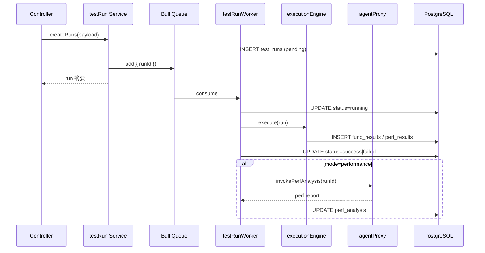

# 接口测试执行 — 服务端层设计

> **读者**：Egg.js BFF / 业务 API 开发者  
> **归属**：`admin-management-station/project-sub/testgen-sub/backend/`  
> **技术栈**：Egg.js + PostgreSQL + Redis + BullMQ（可选）+ egg-socket.io（Phase 2）  
> **规范**：对齐 [admin-management-station](../../../admin-management-station) 子应用 BFF 规范（`egg-backend.mdc`、`database-schema-sync.mdc`、`postgresql.mdc`）  
> **边界**：**不含 Agent / LLM 实现** — 含 HTTP 执行引擎、队列、结果持久化、**性能分析 Agent HTTP 代理**  
> **参考**：[source.md](./source.md) §4、§5 · [测试用例生成-服务端层设计](../testgen/测试用例生成-服务端层设计.md)

---

## 1. 定位与职责

在 **已有 testgen BFF**（文档、生成任务、用例 CRUD）上扩展 **接口测试执行** 能力。

| 模块 | 职责 | 对应 source.md |
|------|------|----------------|
| `envConfig` | 多环境 base_url、公共 Header | §5.1.2 env_configs |
| `testRun` | 创建 run、状态机、取消 | §4.2.1 runTestTask |
| `executionEngine` | HTTP 请求、断言、并发控制 | §4.2.3 任务队列 |
| `testResult` | func_results / perf_results 写入与查询 | §4.3.2 测试结果 API |
| `agentProxy` | 性能 run 完成后 invoke 性能瓶颈 Skill | §6.2 性能瓶颈预测 |
| `io`（P2） | WebSocket 转发执行进度 | §4.2.2 WebSocket |

**不在本次范围**：`generationJob`、`document` 解析、Agent 用例生成（已有）。

```
前端 ──REST──► testgen BFF (:7004)
                  ├─ PostgreSQL（扩展 test_cases + 新表）
                  ├─ Redis + BullMQ（test-run 队列）
                  ├─ executionEngine（axios/got 发 HTTP）
                  └─ agentProxy ──HTTP──► Agent 平台 perf-bottleneck-skill
```

---

## 2. 目录增量

```
testgen-sub/backend/app/
├── controller/
│   ├── testRun.js              # 新增
│   ├── testResult.js           # 新增
│   └── envConfig.js            # 新增
├── service/
│   ├── testRun.js
│   ├── executionEngine.js      # HTTP + 断言
│   ├── testResult.js
│   ├── envConfig.js
│   └── agentProxy.js           # 扩展：invokePerfAnalysis
├── model/
│   ├── test_run.js
│   ├── func_result.js
│   ├── perf_result.js
│   ├── env_config.js
│   └── test_case.js            # 扩展 http_config 字段
├── queue/
│   └── testRunWorker.js        # Bull 消费者
└── io/
    └── controller/testRun.js     # Phase 2
```

---

## 3. 数据库设计（增量 migration）

在现有 `testgen_db` 上追加 migration `002_api_test_execution.sql`。

### 3.1 扩展 `test_cases`

```sql
ALTER TABLE test_cases
  ADD COLUMN IF NOT EXISTS http_config JSONB DEFAULT NULL;
-- http_config: { method, url, headers, body, assertions[] }
CREATE INDEX IF NOT EXISTS idx_test_cases_http_config ON test_cases USING GIN (http_config);
```

生成用例可后补 `http_config`；无 `http_config` 时执行引擎尝试从 `steps` 解析 API 步骤（Phase 2）。

### 3.2 环境配置 `env_configs`

```sql
CREATE TABLE IF NOT EXISTS env_configs (
  id              SERIAL PRIMARY KEY,
  name            VARCHAR(255) NOT NULL,
  description     TEXT,
  base_url        VARCHAR(1024) NOT NULL,
  headers_template JSONB DEFAULT '{}',
  variables       JSONB DEFAULT '{}',
  created_at      TIMESTAMPTZ DEFAULT NOW(),
  updated_at      TIMESTAMPTZ DEFAULT NOW()
);
CREATE INDEX IF NOT EXISTS idx_env_configs_name ON env_configs (name);
```

### 3.3 执行记录 `test_runs`

```sql
CREATE TABLE IF NOT EXISTS test_runs (
  id                SERIAL PRIMARY KEY,
  batch_id          UUID,                              -- 批量执行共享
  case_id           INT REFERENCES test_cases(id) ON DELETE SET NULL,
  env_id            INT REFERENCES env_configs(id) ON DELETE SET NULL,
  mode              VARCHAR(16) NOT NULL DEFAULT 'functional',  -- functional | performance
  status            VARCHAR(16) NOT NULL DEFAULT 'pending',
  -- pending | running | success | failed | cancelled
  progress          REAL DEFAULT 0,
  concurrency       INT DEFAULT 1,
  total_requests    INT,
  success_requests  INT,
  error_requests    INT,
  perf_analysis     JSONB DEFAULT NULL,                -- Agent 报告落库
  perf_analysis_status VARCHAR(16) DEFAULT 'none',     -- none | pending | done | failed
  agent_run_id      INT,
  error_message     TEXT,
  log_tail          TEXT,
  started_at        TIMESTAMPTZ,
  finished_at       TIMESTAMPTZ,
  created_at        TIMESTAMPTZ DEFAULT NOW(),
  updated_at        TIMESTAMPTZ DEFAULT NOW()
);
CREATE INDEX IF NOT EXISTS idx_test_runs_case ON test_runs (case_id);
CREATE INDEX IF NOT EXISTS idx_test_runs_status ON test_runs (status);
CREATE INDEX IF NOT EXISTS idx_test_runs_batch ON test_runs (batch_id);
```

### 3.4 功能结果 `func_results`

```sql
CREATE TABLE IF NOT EXISTS func_results (
  id               SERIAL PRIMARY KEY,
  run_id           INT NOT NULL REFERENCES test_runs(id) ON DELETE CASCADE,
  request_index    INT DEFAULT 0,
  status           VARCHAR(16) NOT NULL,               -- success | failed
  response_time_ms INT,
  http_status_code INT,
  response_body    JSONB,
  error_message    TEXT,
  assertion_details JSONB DEFAULT '[]',
  created_at       TIMESTAMPTZ DEFAULT NOW()
);
CREATE INDEX IF NOT EXISTS idx_func_results_run ON func_results (run_id);
```

### 3.5 性能结果 `perf_results`

```sql
CREATE TABLE IF NOT EXISTS perf_results (
  id                 SERIAL PRIMARY KEY,
  run_id             INT NOT NULL REFERENCES test_runs(id) ON DELETE CASCADE,
  window_start       TIMESTAMPTZ NOT NULL,
  tps                REAL,
  avg_response_time_ms INT,
  p95_response_time_ms INT,
  error_rate         REAL,
  created_at         TIMESTAMPTZ DEFAULT NOW()
);
CREATE INDEX IF NOT EXISTS idx_perf_results_run ON perf_results (run_id);
```

---

## 4. REST API 设计

统一响应（对齐 `egg-backend.mdc`）：

```json
{ "code": 0, "message": "ok", "data": {} }
```

### 4.1 环境配置 `/api/env-configs`

| 方法 | 路径 | 说明 |
|------|------|------|
| GET | `/api/env-configs` | 列表 |
| POST | `/api/env-configs` | 创建（P2 管理 UI） |
| GET | `/api/env-configs/:id` | 详情 |
| PUT | `/api/env-configs/:id` | 更新 |
| DELETE | `/api/env-configs/:id` | 删除 |

种子数据：插入 `local` / `staging` 两条默认环境。

### 4.2 测试执行 `/api/test-runs`

| 方法 | 路径 | 说明 |
|------|------|------|
| POST | `/api/test-runs` | 创建并排队执行 |
| GET | `/api/test-runs` | 分页列表（P2） |
| GET | `/api/test-runs/:id` | 状态 + progress + metrics 摘要 |
| POST | `/api/test-runs/:id/cancel` | 取消 RUNNING |
| GET | `/api/test-runs/:id/results` | func + perf + perf_analysis |

#### POST /api/test-runs

**请求**：

```json
{
  "case_ids": [1, 2],
  "env_id": 1,
  "mode": "functional",
  "concurrency": 1,
  "perf_options": {
    "duration_sec": 60,
    "target_rps": 50
  }
}
```

**响应**：

```json
{
  "code": 0,
  "message": "ok",
  "data": {
    "run_id": 100,
    "batch_id": "550e8400-e29b-41d4-a716-446655440000",
    "status": "pending",
    "child_run_ids": [100, 101]
  }
}
```

**编排流程**：



### 4.3 测试用例 PUT 扩展

已有 `PUT /api/test-cases/:id` 增加 `http_config` 校验：

```javascript
// validate rules
http_config: {
  type: 'object',
  required: false,
  rule: {
    method: { type: 'enum', values: ['GET','POST','PUT','DELETE','PATCH'] },
    url: { type: 'string', min: 1 },
    assertions: { type: 'array' },
  },
},
```

---

## 5. 执行引擎 `executionEngine.js`

### 5.1 功能测试

1. 读取 `test_case.http_config` + `env_config.base_url` 拼完整 URL
2. 合并 `headers_template` 与 case headers
3. `axios` 发请求，记录 `response_time_ms`
4. 按 `assertions` 校验：
   - `status`：HTTP 状态码
   - `json_path`：JSONPath 等于/包含
   - `latency_ms`：响应时间上限
5. 写入 `func_results`，更新 run `progress`

### 5.2 性能测试

- `mode=performance` 时按 `perf_options` 循环发压（受 `concurrency` 限制）
- 每 `window_sec`（默认 5s）聚合写入 `perf_results`
- 完成后触发 Agent 分析（异步，不阻塞 run 状态置 success）

### 5.3 队列

```javascript
// config.default.js
exports.testRunQueue = {
  maxConcurrent: Number(process.env.MAX_CONCURRENT_RUNS || 5),
  redis: { host: process.env.REDIS_HOST || '127.0.0.1', port: 6379 },
};
```

并发超限时 run 保持 `pending`，Worker 按 FIFO 消费。

---

## 6. Agent 代理（仅性能瓶颈预测）

扩展 `app/service/agentProxy.js`：

```javascript
async invokePerfAnalysis({ run_id, perf_samples, case_meta, env_name }) {
  const { baseUrl, invokePath, timeout } = this.config.agentPlatform;
  const path = invokePath.replace('testgen-skill', 'perf-bottleneck-skill');
  const res = await this.ctx.curl(`${baseUrl}${path}`, {
    method: 'POST',
    contentType: 'json',
    data: {
      action: 'analyze',
      run_id,
      perf_samples,      // perf_results 聚合
      case_meta,
      env_name,
    },
    dataType: 'json',
    timeout: timeout || 120000,
  });
  if (res.status !== 200) throw new Error(res.data?.message || 'Agent 调用失败');
  return res.data;
}
```

**触发条件**：`test_runs.mode === 'performance'` 且 `status` 即将置为 `success`。

**落库**：`perf_analysis` ← `output.report`；`perf_analysis_status` ← `done|failed`；`agent_run_id` ← `meta.run_id`。

**失败策略**：Agent 失败不影响 run 主状态；`perf_analysis_status=failed` 并记录 `error_message`。

---

## 7. WebSocket（Phase 2）

| 命名空间 | 事件 | 载荷 |
|----------|------|------|
| `/test-runs` | `progress` | `{ run_id, status, progress, metrics_point }` |
| `/test-runs` | `log` | `{ run_id, line }` |

Worker 在更新 progress 时 `emit`；前端 **不** 连接 Agent 平台。

---

## 8. 安全与权限

| 项 | 要求 |
|----|------|
| 写接口 | JWT + RBAC（`testgen:run`、`testgen:edit`） |
| SSRF | `base_url` 白名单或内网段限制（config） |
| 日志 | 不打印完整 response_body（可截断） |
| Agent | 仅服务端 invoke；`AGENT_PLATFORM_URL` 环境变量 |

---

## 9. 配置与环境变量

```bash
# .env.example 增量
REDIS_HOST=127.0.0.1
REDIS_PORT=6379
MAX_CONCURRENT_RUNS=5
AGENT_PLATFORM_URL=http://127.0.0.1:4001
PERF_SKILL_INVOKE_PATH=/api/skills/perf-bottleneck-skill/invoke
ALLOWED_ENV_HOSTS=localhost,127.0.0.1,*.internal
```

---

## 10. 与 source.md 对照

| source.md | 本设计 |
|-----------|--------|
| 独立 egg-test-system | 扩展 testgen-sub 自包含子应用 |
| test_cases 含 method/url 列 | `http_config` JSONB 扩展，兼容生成用例 |
| callAI generateTestCases | **剔除** |
| callAI analyzePerfBottleneck | `agentProxy.invokePerfAnalysis` + Skill |
| code: 200 | 统一 `code: 0`（与现有 testgen BFF 一致） |

---

## 11. 验收清单（设计阶段）

- [ ] migration 002 同步启动无报错
- [ ] POST /test-runs 功能模式写入 func_results
- [ ] 性能模式写入 perf_results 并异步触发 Agent
- [ ] GET /test-runs/:id/results 含 perf_analysis
- [ ] PUT /test-cases/:id 接受 http_config
- [ ] 无 LLM 直连、无用例生成 Agent 调用

---

## 12. 相关文档

- [接口测试执行-前端层设计](./接口测试执行-前端层设计.md)
- [接口测试执行-Agent与BFF层设计](./接口测试执行-Agent与BFF层设计.md)
- [测试用例生成-服务端层设计](../testgen/测试用例生成-服务端层设计.md)
- [项目索引](./README.md)
