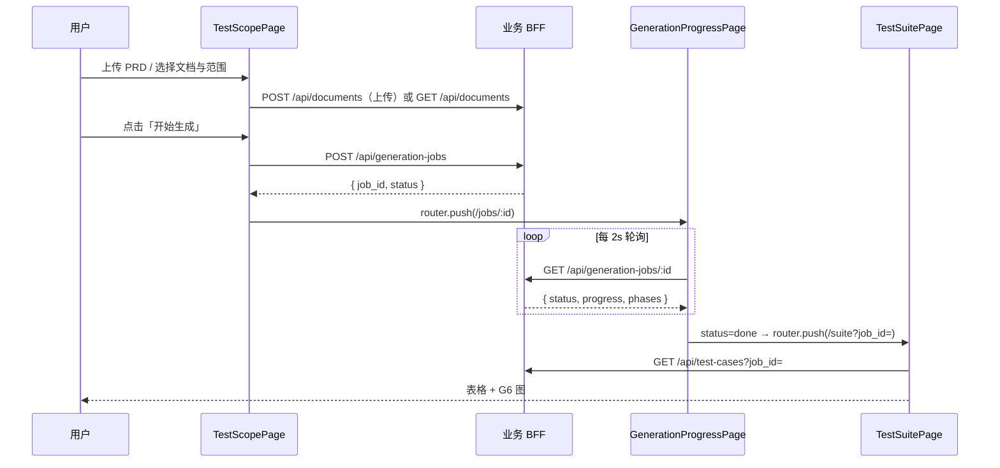

# 测试用例生成 — 前端层设计

> **读者**：Vue 3 子应用前端开发者  
> **技术栈**：Vue 3 + Element Plus + AntV G6/X6 + Pinia + Vite + Qiankun（可选嵌入）  
> **规范**：对齐 [admin-management-station](../../../admin-management-station) 子应用前端规范（`vue-web-subapp.mdc`、`subapp-onboarding.mdc`）  
> **边界**：**不含 Agent / MCP 客户端** — 仅调用业务 BFF REST API  
> **参考**：[source.md](./source.md) §3.1、§4.1、§6、§7.1–7.2、§7.11

---

## 1. 定位与职责

前端提供测试用例生成平台的 **配置、进度、结果展示、用例管理** 能力，通过 **业务 BFF** 间接使用 Agent 能力，不直连 Agent 平台或 MCP。

| 职责 | 说明 |
|------|------|
| 测试范围配置 | 业务模块、测试类型、关联 PRD/API 文档 |
| 文档上传 | PDF / Markdown / OpenAPI，调用 BFF 解析入库 |
| 生成任务编排 | 创建 `generation_jobs`，跳转进度页 |
| 进度展示 | 轮询 job 状态（P1）；可选 WebSocket/SSE（P2，由 BFF 转发） |
| 可视化 | X6 测试范围画布；G6 用例依赖图 |
| 用例管理 | 表格筛选、详情、导出、删除 |

```
用户操作 → Vue 页面 → 业务 BFF REST (:700x)
                         ├─ CRUD 文档/知识库/用例
                         └─ POST /api/generation-jobs → 服务端代理 Agent
进度/结果 ← 轮询 GET /generation-jobs/:id（默认）
         ← 可选 WS /api/ws/jobs/:id（BFF 转发，Phase 2）
```

---

## 2. 应用形态与目录结构

作为 **Qiankun 子应用** 或独立 SPA，目录参考 `novel-sub/frontend/`：

```
testgen-sub/frontend/
├── src/
│   ├── App.vue
│   ├── main.js                         # Qiankun 生命周期 + Pinia
│   ├── router/index.js
│   ├── stores/
│   │   ├── generationJob.js            # 任务进度、phase 状态
│   │   └── testSuite.js                # 用例列表、筛选条件
│   ├── layouts/
│   │   └── MainLayout.vue              # 左侧菜单 + 右侧内容（嵌入态可隐藏侧栏）
│   ├── views/
│   │   ├── TestScopePage.vue           # 测试范围配置 + X6 画布
│   │   ├── GenerationProgressPage.vue  # 生成进度、步骤、控制按钮
│   │   └── TestSuitePage.vue           # 用例列表 + G6 依赖图
│   ├── components/
│   │   ├── TestScopeForm.vue           # 模块/类型/文档表单
│   │   ├── DocumentUpload.vue          # el-upload 封装
│   │   ├── VisualizeCanvas.vue         # AntV X6 测试范围画布
│   │   ├── GenerationProgress.vue      # el-progress + el-steps
│   │   ├── ProgressPoller.vue          # 轮询逻辑（可组合式函数）
│   │   ├── ResultTable.vue             # 用例结果表格
│   │   ├── TestSuiteGraph.vue          # AntV G6 依赖图
│   │   ├── TestCaseDetailDrawer.vue    # 用例详情抽屉
│   │   └── PageShell.vue               # 复用 novel-sub 页面壳
│   ├── composables/
│   │   ├── useJobProgress.js           # 轮询 / 可选 WS
│   │   ├── useTestCaseFilters.js
│   │   └── useGraphData.js             # 用例 → G6/X6 图数据转换
│   ├── services/
│   │   ├── apiConfig.js
│   │   ├── documentService.js
│   │   ├── generationService.js
│   │   ├── knowledgeService.js
│   │   └── testCaseService.js
│   ├── utils/
│   │   ├── statusColors.js             # 状态/优先级/置信度色值
│   │   └── formatSteps.js
│   └── qiankun/config.js
├── vite.config.js
├── package.json
└── .env.example
```

### 2.1 依赖清单

```bash
npm install vue vue-router pinia element-plus axios
npm install @antv/g6 @antv/x6
npm install vite-plugin-qiankun
# Phase 2 可选
npm install socket.io-client
```

---

## 3. 页面与路由

| 路由 | 页面 | 功能 |
|------|------|------|
| `/` | 重定向 → `/scope` | — |
| `/scope` | TestScopePage | 选择业务模块、测试类型、上传/关联文档、X6 范围预览 |
| `/jobs/:id` | GenerationProgressPage | 四阶段进度、暂停/取消/重试、实时步骤日志 |
| `/suite` | TestSuitePage | 用例列表、G6 依赖图、筛选导出 |
| `/suite/:caseId` | TestSuitePage（抽屉） | 用例详情（query 或子路由） |

```javascript
// router/index.js
import { createRouter, createWebHistory } from 'vue-router';

export function createAppRouter(base = '/') {
  return createRouter({
    history: createWebHistory(base),
    routes: [
      { path: '/', redirect: '/scope' },
      {
        path: '/scope',
        name: 'test-scope',
        component: () => import('../views/TestScopePage.vue'),
        meta: { title: '测试范围配置' },
      },
      {
        path: '/jobs/:id',
        name: 'generation-progress',
        component: () => import('../views/GenerationProgressPage.vue'),
        meta: { title: '生成进度' },
      },
      {
        path: '/suite',
        name: 'test-suite',
        component: () => import('../views/TestSuitePage.vue'),
        meta: { title: '用例管理' },
      },
    ],
  });
}
```

### 3.1 用户交互主流程



---

## 4. API 对接（仅业务 BFF）

### 4.1 apiConfig.js

遵循 [testgen-sub apiConfig](../../../admin-management-station/testgen-sub/frontend/src/services/apiConfig.js) 模式：

```javascript
import axios from 'axios';
import { qiankunWindow } from 'vite-plugin-qiankun/dist/helper';

export function resolveApiBase() {
  const configured = import.meta.env.VITE_API_BASE;
  if (/^https?:\/\//.test(configured || '')) {
    return configured.replace(/\/$/, '');
  }
  if (qiankunWindow.__POWERED_BY_QIANKUN__) {
    return (import.meta.env.VITE_TESTGEN_API_ORIGIN || 'http://localhost:7004') + '/api';
  }
  return (configured || '/api').replace(/\/$/, '');
}

export const api = axios.create({ timeout: 60000 });

api.interceptors.response.use(
  (res) => {
    const { code, message, data } = res.data ?? {};
    if (code !== 0 && code !== 200) {
      return Promise.reject(new Error(message || '请求失败'));
    }
    return { ...res, data: { ...res.data, data } };
  },
  (err) => Promise.reject(err),
);
```

**禁止**：`VITE_AGENT_API_BASE`、`MCPClient`、`/mcp/init` 等 Agent 直连配置。

### 4.2 Service 层接口契约

#### documentService.js

| 方法 | BFF 路径 | 说明 |
|------|----------|------|
| `listDocuments(params)` | `GET /documents` | 分页、`module` 过滤 |
| `uploadDocument(file, meta)` | `POST /documents/upload` | `multipart/form-data` |
| `createDocument(body)` | `POST /documents` | 纯文本/Markdown body |
| `getDocument(id)` | `GET /documents/:id` | 含 `endpoints` 摘要 |
| `deleteDocument(id)` | `DELETE /documents/:id` | — |

```javascript
export async function uploadDocument(file, { title, module, tags } = {}) {
  const form = new FormData();
  form.append('file', file);
  if (title) form.append('title', title);
  if (module) form.append('module', module);
  if (tags) form.append('tags', JSON.stringify(tags));
  const { data } = await api.post(`${resolveApiBase()}/documents/upload`, form);
  return data.data; // { id, title, doc_type, parse_status }
}
```

#### generationService.js

| 方法 | BFF 路径 | 说明 |
|------|----------|------|
| `startGeneration(payload)` | `POST /generation-jobs` | 创建并触发 Agent |
| `getJob(id)` | `GET /generation-jobs/:id` | 状态 + progress |
| `listJobTestCases(id, filters)` | `GET /generation-jobs/:id/test-cases` | 任务下用例 |
| `pauseJob(id)` | `POST /generation-jobs/:id/pause` | Phase 2 |
| `cancelJob(id)` | `POST /generation-jobs/:id/cancel` | 取消任务 |
| `retryJob(id)` | `POST /generation-jobs/:id/retry` | 失败重试 |

```javascript
export async function startGeneration({ document_id, module, test_types, options }) {
  const { data } = await api.post(`${resolveApiBase()}/generation-jobs`, {
    document_id,
    module,
    test_types,
    options, // 如 { include_gdpr: true }
  });
  return data.data; // { job_id, status: 'pending' }
}

export async function getJob(jobId) {
  const { data } = await api.get(`${resolveApiBase()}/generation-jobs/${jobId}`);
  return data.data;
  /*
  {
    id, status, progress: { analyze, functional, edge, review },
    current_phase, error_message, agent_run_id,
    steps: [{ phase, note, test_case_count }],
    updated_at
  }
  */
}
```

#### testCaseService.js

| 方法 | BFF 路径 | 说明 |
|------|----------|------|
| `listTestCases(params)` | `GET /test-cases` | `job_id`, `module`, `type`, `priority` |
| `getTestCase(id)` | `GET /test-cases/:id` | 详情含 steps |
| `updateTestCase(id, body)` | `PUT /test-cases/:id` | 人工修订 |
| `deleteTestCase(id)` | `DELETE /test-cases/:id` | — |
| `exportTestCases(params)` | `GET /test-cases/export` | `format=markdown\|csv` |

#### knowledgeService.js（只读，辅助范围配置）

| 方法 | BFF 路径 | 说明 |
|------|----------|------|
| `listModules()` | `GET /modules` | 业务模块字典 |
| `searchKnowledge(params)` | `GET /knowledge` | `module`, `tag` |

---

## 5. 状态管理（Pinia）

参考 source.md §7.11，将进度与用例列表从页面组件中抽离。

### 5.1 stores/generationJob.js

```javascript
import { defineStore } from 'pinia';
import { getJob, cancelJob, pauseJob, retryJob } from '../services/generationService';

export const useGenerationJobStore = defineStore('generationJob', {
  state: () => ({
    jobId: null,
    status: 'pending',       // pending | running | done | failed | cancelled
    currentPhase: 'analyze', // analyze | functional | edge | review
    progress: { analyze: 0, functional: 0, edge: 0, review: 0 },
    steps: [],
    errorMessage: null,
    pollingTimer: null,
  }),
  getters: {
    overallPercent: (s) => {
      const vals = Object.values(s.progress);
      return Math.round(vals.reduce((a, b) => a + b, 0) / vals.length);
    },
    isTerminal: (s) => ['done', 'failed', 'cancelled'].includes(s.status),
  },
  actions: {
    async fetchJob(jobId) {
      const job = await getJob(jobId);
      this.jobId = job.id;
      this.status = job.status;
      this.currentPhase = job.current_phase;
      this.progress = job.progress ?? this.progress;
      this.steps = job.steps ?? [];
      this.errorMessage = job.error_message;
      return job;
    },
    startPolling(jobId, intervalMs = 2000) {
      this.stopPolling();
      this.jobId = jobId;
      this.pollingTimer = setInterval(() => this.fetchJob(jobId), intervalMs);
      return this.fetchJob(jobId);
    },
    stopPolling() {
      if (this.pollingTimer) {
        clearInterval(this.pollingTimer);
        this.pollingTimer = null;
      }
    },
    async cancel() {
      await cancelJob(this.jobId);
      await this.fetchJob(this.jobId);
      this.stopPolling();
    },
    reset() {
      this.stopPolling();
      this.$reset();
    },
  },
});
```

### 5.2 stores/testSuite.js

```javascript
export const useTestSuiteStore = defineStore('testSuite', {
  state: () => ({
    cases: [],
    filters: { job_id: null, module: '', type: '', priority: '', status: '' },
    loading: false,
  }),
  getters: {
    filteredCases(state) {
      return state.cases.filter((tc) => {
        const { module, type, priority, status } = state.filters;
        if (module && tc.module !== module) return false;
        if (type && tc.type !== type) return false;
        if (priority && tc.priority !== priority) return false;
        if (status && tc.status !== status) return false;
        return true;
      });
    },
  },
});
```

---

## 6. 核心组件设计

### 6.1 MainLayout — 应用布局

参考 source.md §7.2.1，标准 **左侧菜单 + 右侧内容**；Qiankun 嵌入时由主应用提供顶栏，子应用隐藏重复 Header。

| 区域 | 组件 | 行为 |
|------|------|------|
| 侧栏 | `el-menu` | 「测试范围」「用例管理」；当前 job 进行中时高亮进度入口 |
| 内容区 | `router-view` | 内嵌 `PageShell` 统一标题与操作区 |
| 顶栏 | `Header.vue` | 仅独立 SPA 模式显示 |

### 6.2 TestScopePage — 测试范围配置

**布局**：上表单 + 下 X6 画布预览。

#### TestScopeForm 字段

| 字段 | 组件 | 校验 | 选项示例 |
|------|------|------|----------|
| 业务模块 | `el-select` | 必填 | 课程预约、设备借用、会员管理 |
| 测试类型 | `el-select multiple` | 至少 1 项 | 功能测试、边界值测试、GDPR 合规测试 |
| 关联文档 | `DocumentUpload` + `el-select` | 必填 | `GET /api/documents` 列表 + 本地上传 |
| 合规标签 | `el-checkbox-group` | 可选 | GDPR-Article-9、健康数据导出 |
| 备注 | `el-input textarea` | 可选 | 传给 BFF `options.hint` |

#### DocumentUpload

```javascript
const ALLOWED_TYPES = [
  'application/pdf',
  'text/markdown',
  'application/json', // OpenAPI
];
const MAX_SIZE_MB = 20;

function beforeUpload(file) {
  if (!ALLOWED_TYPES.includes(file.type)) {
    ElMessage.error('仅支持 PDF、Markdown、OpenAPI JSON');
    return false;
  }
  if (file.size > MAX_SIZE_MB * 1024 * 1024) {
    ElMessage.error(`文件不能超过 ${MAX_SIZE_MB}MB`);
    return false;
  }
  return true;
}
```

**提交**：`POST /api/generation-jobs` → `router.push({ name: 'generation-progress', params: { id: job_id } })`。

### 6.3 VisualizeCanvas — AntV X6 测试范围画布

参考 source.md §7.2.4，用于 **配置阶段静态预览** 与 **生成阶段动态着色**（数据来自 job.progress，非直连 Agent）。

| 节点类型 | 含义 | 样式 |
|----------|------|------|
| `module` | 业务模块 | 圆角矩形，主题色边框 |
| `doc` | 关联文档 | 文档图标节点 |
| `test-type` | 测试类型 | 菱形 |
| `phase` | Loop 四阶段 | 横向流程节点 |

```javascript
import { Graph } from '@antv/x6';

export function buildScopeGraph({ module, testTypes, documentTitle, progress }) {
  const nodes = [
    { id: 'doc', shape: 'rect', label: documentTitle, data: { type: 'doc' } },
    { id: 'module', shape: 'rect', label: module, data: { type: 'module' } },
    ...testTypes.map((t, i) => ({
      id: `type-${i}`,
      shape: 'polygon',
      label: t,
      data: { type: 'test-type' },
    })),
    ...['analyze', 'functional', 'edge', 'review'].map((phase) => ({
      id: phase,
      shape: 'rect',
      label: phase,
      attrs: {
        body: {
          fill: (progress?.[phase] ?? 0) >= 100 ? '#67c23a' : '#e4e7ed',
        },
      },
    })),
  ];
  // edges: doc → module → types → phases
  return { nodes, edges: [/* ... */] };
}
```

**Phase 2**：可选订阅 BFF `WS /api/ws/jobs/:id/visualize`，消息格式 `{ type: 'VISUAL_UPDATE', graphData }`，与 source.md §6.1.6 对齐。

### 6.4 GenerationProgressPage — 进度跟踪

#### UI 结构

1. **总进度**：`el-progress :percentage="store.overallPercent"`
2. **阶段步骤**：`el-steps`，四步对应 Loop phase（analyze → functional → edge → review）
3. **步骤日志**：`el-timeline`，展示 `job.steps[].note`
4. **操作栏**：取消（`danger`）、重试（`failed` 时）、前往用例列表（`done` 时）

#### composables/useJobProgress.js

```javascript
import { onMounted, onUnmounted, watch } from 'vue';
import { useRouter } from 'vue-router';
import { useGenerationJobStore } from '../stores/generationJob';

export function useJobProgress(jobId) {
  const store = useGenerationJobStore();
  const router = useRouter();

  onMounted(() => store.startPolling(jobId));
  onUnmounted(() => store.stopPolling());

  watch(
    () => store.status,
    (status) => {
      if (status === 'done') {
        router.push({ name: 'test-suite', query: { job_id: jobId } });
      }
    },
  );

  return { store };
}
```

**默认策略**：2s 轮询 `GET /api/generation-jobs/:id`（对应 source.md 进度查询，替代前端直连 `ws://.../ws/progress`）。

**Phase 2 WebSocket**（BFF 转发，前端仍不连 Agent）：

```javascript
// 仅当 VITE_ENABLE_JOB_WS=true
import { io } from 'socket.io-client';
const socket = io(`${wsOrigin}/jobs`, { query: { job_id: jobId } });
socket.on('progress', (payload) => store.applyWsPayload(payload));
```

消息格式对齐 source.md §6.1.5：`{ type: 'UPDATE', status, progress, message, phase }`。

### 6.5 ResultTable — 用例结果表格

参考 source.md §7.2.5，展示生成结果与管理列表。

| 列 | 字段 | 展示 |
|----|------|------|
| 用例 ID | `case_id` | 可复制 |
| 标题 | `title` | 链接打开详情抽屉 |
| 模块 | `module` | tag |
| 类型 | `type` | functional / edge / security |
| 测试步骤 | `steps` | 折叠展示，含预期结果 |
| 状态 | `status` | 待执行 / 进行中 / 成功 / 失败 |
| 置信度 | `confidence` | 0–1，背景色分级 |
| 合规度 | `compliance` | 未验证 / 通过 / 风险 |
| 优先级 | `priority` | 高 / 中 / 低（原方案「轻中高」映射为 low/medium/high） |
| 操作 | — | 查看、编辑、删除 |

```javascript
// utils/statusColors.js
export function confidenceColor(v) {
  if (v >= 0.9) return '#67c23a';
  if (v >= 0.7) return '#e6a23c';
  return '#f56c6c';
}

export const statusColorMap = {
  待执行: '#909399',
  进行中: '#409eff',
  成功: '#67c23a',
  失败: '#f56c6c',
};
```

### 6.6 TestSuiteGraph — AntV G6 用例依赖图

参考 source.md §4.1 可视化目标与 G6 选型。

| 模式 | 说明 | 布局 |
|------|------|------|
| 流程图 | analyze → functional → edge → review | `dagre` TB |
| 用例依赖图 | 用例为节点，共享前置条件/模块为边 | `dagre` LR |
| 模块聚类 | 按 `module` 分组 | `combo` |

```javascript
import G6 from '@antv/g6';

export function initSuiteGraph(container, testCases) {
  const graph = new G6.Graph({
    container,
    layout: { type: 'dagre', rankdir: 'TB', nodesep: 40, ranksep: 60 },
    modes: { default: ['drag-node', 'zoom-canvas', 'click-select'] },
    defaultNode: { type: 'rect', style: { radius: 4 } },
    defaultEdge: { type: 'polyline' },
  });
  graph.data(convertCasesToGraph(testCases));
  graph.render();
  return graph;
}

function convertCasesToGraph(cases) {
  const nodes = cases.map((tc) => ({
    id: tc.case_id,
    label: tc.title,
    module: tc.module,
    style: { fill: priorityFill(tc.priority) },
  }));
  const edges = []; // 同 module 或相同 preconditions 关键词连边
  return { nodes, edges };
}
```

### 6.7 TestSuitePage — 用例管理

参考 source.md §4.3、§7.2.3。

**筛选区**：`el-select` 状态 / 优先级 / 模块 / 类型；与 URL query 同步便于分享。

**导出**：`GET /api/test-cases/export?job_id=&format=markdown`，`window.open` 或 blob 下载。

**空态**：无 `job_id` 时展示最近任务引导回 `/scope`。

---

## 7. Qiankun 集成

若嵌入 admin-management-station 主应用：

1. 登记 `subapp_registry`（`microapp_name=testgen`、`route_prefix=/testgen`、`entry`）
2. `vite-plugin-qiankun` 导出 `bootstrap` / `mount` / `unmount`
3. `mount` 时从 props 读取 `routerBase`，`createAppRouter(routerBase)`
4. 嵌入态：`__POWERED_BY_QIANKUN__` 时隐藏 `MainLayout` 顶栏，API 使用 **子 BFF 绝对 URL**
5. 独立 dev：`VITE_API_BASE=http://localhost:7004/api`

```javascript
// main.js（示意）
import { renderWithQiankun, qiankunWindow } from 'vite-plugin-qiankun/dist/helper';

function render(props = {}) {
  const { container, routerBase } = props;
  const app = createApp(App);
  app.use(createPinia());
  app.use(createAppRouter(routerBase || '/'));
  app.use(ElementPlus);
  app.mount(container ? container.querySelector('#app') : '#app');
}

renderWithQiankun({
  bootstrap() {},
  mount(props) { render(props); },
  unmount() { /* app.unmount */ },
});

if (!qiankunWindow.__POWERED_BY_QIANKUN__) {
  render();
}
```

详见 [subapp-onboarding.mdc](../../../admin-management-station/.cursor/rules/subapp-onboarding.mdc)。

---

## 8. 环境变量

```bash
# .env.example
VITE_APP_KEY=testgen
VITE_DEV_PORT=5175
VITE_API_BASE=http://localhost:7004/api
# Qiankun 嵌入时（跨 origin 请求子 BFF）
VITE_TESTGEN_API_ORIGIN=http://localhost:7004
# Phase 2 可选
VITE_ENABLE_JOB_WS=false
VITE_WS_ORIGIN=http://localhost:7004
```

---

## 9. 与原方案（source.md）的差异

| source.md 原方案 | 优化后（本文档） |
|------------------|------------------|
| `POST /api/upload-file` + `fileMetaId` | `POST /api/documents/upload` → `document_id` |
| `POST /api/generate-test-case` | `POST /api/generation-jobs` |
| `GET /api/progress/:id` | `GET /api/generation-jobs/:id`（含 phase 级 progress） |
| 前端 WebSocket 直连 `ws://.../progress` | 默认轮询；可选 BFF 转发 WS |
| 前端 `MCPClient` / SSE 直连 Agent | 禁止；进度来自 BFF job 字段 |
| 单页合并「生成 + 管理」 | 分 `/scope`、`/jobs/:id`、`/suite` 三页 |
| Pinia + 页面内 WS | Pinia + `useJobProgress` 轮询（WS 可选） |

---

## 10. 错误与边界处理

| 场景 | 前端行为 |
|------|----------|
| 文档解析失败 | `parse_status=failed` 时禁用「开始生成」，展示 `parse_error` |
| Job 失败 | 展示 `error_message`，提供「重试」 |
| 轮询中断 | 页面 `visibilitychange` 时暂停/恢复轮询 |
| 离开进度页 | `onUnmounted` 调用 `store.stopPolling()` |
| 嵌入跨域 | 必须使用 `VITE_TESTGEN_API_ORIGIN` 绝对地址 |
| 导出过大 | 按钮 loading，超时提示分批导出 |

---

## 11. 验收清单

- [ ] 独立 `npm run dev` 可访问 `/scope`、`/jobs/:id`、`/suite`
- [ ] Qiankun 嵌入时 API 请求 **子 BFF 绝对 URL**（非主应用 :7001）
- [ ] 上传 PDF/Markdown → 选范围 → 创建 job → 进度四阶段 → 用例列表/导出 全流程
- [ ] 无 `@mcp/client`、无 Agent 相关 env
- [ ] X6 画布随 job.progress 更新着色
- [ ] G6 依赖图随用例列表加载渲染
- [ ] ResultTable 置信度/优先级/状态色符合 `statusColors.js`
- [ ] Pinia store 在路由切换时正确清理轮询

---

## 12. 相关文档

- [测试用例生成-Agent与BFF层设计](./测试用例生成-Agent与BFF层设计.md) — Loop 四阶段与 `progress` 字段来源
- [测试用例生成-服务端层设计](./测试用例生成-服务端层设计.md) — REST API 与表结构
- [source.md](./source.md) — 原始完整设计报告
- [admin-management-station 子应用前端工作流](../../../admin-management-station/skills/sub-app-developer/vue-frontend.md)
- [项目索引](./README.md)
