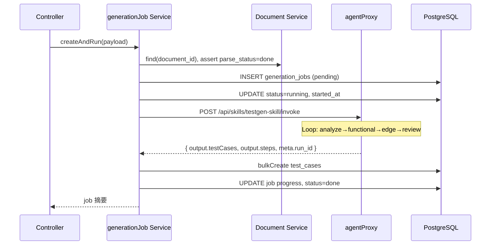

# 测试用例生成 — 服务端层设计

> **读者**：Egg.js BFF / 业务 API 开发者  
> **技术栈**：Egg.js + PostgreSQL + Redis（可选 BullMQ / egg-socket.io）  
> **规范**：对齐 [admin-management-station](../../../admin-management-station) 子应用 BFF 开发规范（`egg-backend.mdc`）  
> **边界**：**不含 Agent / MCP / LLM 实现** — 仅 REST 业务 API、工具服务、数据持久化、Agent 平台 HTTP 代理  
> **参考**：[source.md](./source.md) §3.2、§5、§6、§7.3、§7.7–7.10

---

## 1. 定位与职责

服务端层为测试用例生成平台提供 **业务数据、工具能力、生成任务编排**，供：

- **Agent 层**（`testgen-skill` 的 `enrichContext`）通过 HTTP 拉取文档与知识
- **前端层**通过 REST 管理测试范围、跟踪 job 进度、查看/导出用例

```
前端 (:517x)  ──REST──►  业务 BFF (:700x)  ──HTTP invoke──►  Agent 平台 (:3001)
                              │
                              ├─ PostgreSQL（documents / jobs / test_cases）
                              ├─ Redis（解析缓存、可选队列）
                              └─ 工具 Service（PDF/MD 解析、知识库、边界值）
```

| 模块 | 职责 | 对应 source.md |
|------|------|----------------|
| `document` | PRD/API 文档上传、解析、元数据 | §7.3.2 文件上传与解析 |
| `knowledge` | 知识库 CRUD、按模块/标签检索 | §7.3.4 知识库查询 |
| `testCase` | 用例 CRUD、筛选、导出 | §4.3 用例管理 |
| `generationJob` | 任务状态机、代理 Agent、进度同步 | §7.3.3、§7.8 队列与任务 |
| `module` | 业务模块字典 | 健身场景模块 |
| `tools` | Agent 可调用的 HTTP 工具端点（非 MCP） | §4.2 服务端工具 |

---

## 2. 应用形态（自包含子应用）

建议作为独立子应用 `testgen-sub/`，遵循自包含架构：

```
testgen-sub/
├── backend/
│   ├── app/
│   │   ├── controller/
│   │   │   ├── document.js
│   │   │   ├── knowledge.js
│   │   │   ├── generationJob.js
│   │   │   ├── testCase.js
│   │   │   ├── module.js
│   │   │   └── tools.js              # Agent 工具 HTTP 端点
│   │   ├── service/
│   │   │   ├── document.js
│   │   │   ├── docParser.js
│   │   │   ├── knowledge.js
│   │   │   ├── generationJob.js
│   │   │   ├── testCase.js
│   │   │   ├── agentProxy.js         # 调用 Agent 平台
│   │   │   └── boundaryHelper.js
│   │   ├── model/
│   │   ├── middleware/
│   │   │   ├── errorHandler.js
│   │   │   └── validate.js
│   │   ├── queue/                    # 可选 BullMQ
│   │   │   └── generationWorker.js
│   │   └── io/                       # Phase 2 WebSocket
│   │       └── controller/job.js
│   ├── config/
│   │   ├── config.default.js
│   │   └── plugin.js
│   └── app.js
├── database/
│   ├── init.sql
│   └── migrations/
├── frontend/
└── deploy/                           # ams-testgen
```

**参考**：[testgen-sub/backend](../../../admin-management-station/testgen-sub/backend) 目录结构与响应格式。

---

## 3. 技术插件

```javascript
// config/plugin.js
exports.sequelize = { enable: true, package: 'egg-sequelize' };
exports.cors = { enable: true, package: 'egg-cors' };
exports.validate = { enable: true, package: 'egg-validate' };
// 可选
exports.redis = { enable: true, package: 'egg-redis' };
exports.io = { enable: true, package: 'egg-socket.io' };
```

```javascript
// config/config.default.js（节选）
exports.sequelize = {
  dialect: 'postgres',
  host: process.env.POSTGRES_HOST || '127.0.0.1',
  port: Number(process.env.POSTGRES_PORT || 5432),
  database: process.env.POSTGRES_DB || 'testgen_db',
  username: process.env.POSTGRES_USER || 'postgres',
  password: process.env.POSTGRES_PASSWORD || '',
  timezone: '+08:00',
  define: { underscored: true, timestamps: true },
};

exports.agentPlatform = {
  baseUrl: process.env.AGENT_PLATFORM_URL || 'http://127.0.0.1:3001',
  invokePath: '/api/skills/testgen-skill/invoke',
  timeout: 300000,
};

exports.testgen = {
  maxConcurrentJobs: Number(process.env.MAX_CONCURRENT_JOBS || 3),
  parseCacheTtl: 3600,
  uploadDir: process.env.UPLOAD_DIR || '/tmp/testgen-uploads',
  maxUploadBytes: 20 * 1024 * 1024,
};
```

---

## 4. 数据库设计

在优化版表结构基础上，合并 source.md §5 中的 **置信度、合规度、执行状态** 等字段，并补充索引。

### 4.1 文档表 `documents`

```sql
CREATE TABLE documents (
  id            SERIAL PRIMARY KEY,
  title         VARCHAR(255) NOT NULL,
  doc_type      VARCHAR(32) NOT NULL DEFAULT 'markdown',  -- markdown | pdf | openapi
  content       TEXT,                                     -- 纯文本 / 解析后正文
  file_path     VARCHAR(512),
  file_size     INT,
  source        VARCHAR(64) DEFAULT 'upload',           -- upload | paste | fixture
  parse_status  VARCHAR(32) DEFAULT 'pending',            -- pending | parsing | done | failed
  parse_error   TEXT,
  parsed_meta   JSONB DEFAULT '{}',                       -- { chapters, endpoints, tables }
  tags          JSONB DEFAULT '[]',
  metadata      JSONB DEFAULT '{}',                       -- { module, compliance_tags }
  upload_user   VARCHAR(100),
  created_at    TIMESTAMPTZ DEFAULT NOW(),
  updated_at    TIMESTAMPTZ DEFAULT NOW()
);

CREATE INDEX idx_documents_metadata ON documents USING GIN (metadata);
CREATE INDEX idx_documents_parse_status ON documents (parse_status);
CREATE INDEX idx_documents_doc_type ON documents (doc_type);
```

**与 source.md `file_metas` 映射**：`file_name` → `title`，`type` → `doc_type`，`content` JSONB → `parsed_meta` + `content` 文本。

### 4.2 知识库表 `knowledge_entries`

```sql
CREATE TABLE knowledge_entries (
  id          SERIAL PRIMARY KEY,
  module      VARCHAR(64) NOT NULL,
  tag         VARCHAR(64),
  title       VARCHAR(255),
  content     TEXT NOT NULL,
  entity_refs JSONB DEFAULT '[]',
  created_at  TIMESTAMPTZ DEFAULT NOW(),
  updated_at  TIMESTAMPTZ DEFAULT NOW()
);

CREATE INDEX idx_knowledge_module_tag ON knowledge_entries (module, tag);
CREATE INDEX idx_knowledge_content_fts ON knowledge_entries
  USING GIN (to_tsvector('simple', coalesce(title,'') || ' ' || content));
```

### 4.3 生成任务表 `generation_jobs`

```sql
CREATE TABLE generation_jobs (
  id              SERIAL PRIMARY KEY,
  document_id     INT REFERENCES documents(id) ON DELETE SET NULL,
  module          VARCHAR(64) NOT NULL,
  test_types      JSONB NOT NULL DEFAULT '[]',
  options         JSONB DEFAULT '{}',                     -- { include_gdpr, hint }
  status          VARCHAR(32) NOT NULL DEFAULT 'pending',
  -- pending | running | paused | done | failed | cancelled
  current_phase   VARCHAR(32) DEFAULT 'analyze',
  progress        JSONB DEFAULT '{"analyze":0,"functional":0,"edge":0,"review":0}',
  steps_log       JSONB DEFAULT '[]',                       -- [{ phase, note, at, test_case_count }]
  agent_run_id    INT,
  error_message   TEXT,
  created_by      VARCHAR(100),
  started_at      TIMESTAMPTZ,
  finished_at     TIMESTAMPTZ,
  created_at      TIMESTAMPTZ DEFAULT NOW(),
  updated_at      TIMESTAMPTZ DEFAULT NOW()
);

CREATE INDEX idx_generation_jobs_status ON generation_jobs (status);
CREATE INDEX idx_generation_jobs_document ON generation_jobs (document_id);
CREATE INDEX idx_generation_jobs_created_at ON generation_jobs (created_at DESC);
```

**与 source.md `progress` 映射**：`task_id` → `id`（对外 `job_id`）；`progress百分比` → `progress` JSON 聚合；`error_message` 保留。

### 4.4 测试用例表 `test_cases`

```sql
CREATE TABLE test_cases (
  id              SERIAL PRIMARY KEY,
  job_id          INT REFERENCES generation_jobs(id) ON DELETE CASCADE,
  case_id         VARCHAR(64) NOT NULL,
  title           VARCHAR(255) NOT NULL,
  module          VARCHAR(64),
  type            VARCHAR(32),                -- functional | edge | security
  priority        VARCHAR(16) DEFAULT 'medium', -- high | medium | low
  status          VARCHAR(20) DEFAULT 'pending', -- pending | running | passed | failed
  confidence      REAL DEFAULT 0.0 CHECK (confidence >= 0 AND confidence <= 1),
  compliance      VARCHAR(32) DEFAULT 'unverified', -- unverified | pass | risk
  preconditions   TEXT,
  steps           JSONB NOT NULL DEFAULT '[]',
  expected        TEXT,
  tags            JSONB DEFAULT '[]',
  document_id     INT REFERENCES documents(id) ON DELETE SET NULL,
  created_at      TIMESTAMPTZ DEFAULT NOW(),
  updated_at      TIMESTAMPTZ DEFAULT NOW(),
  UNIQUE (job_id, case_id)
);

CREATE INDEX idx_test_cases_job ON test_cases (job_id);
CREATE INDEX idx_test_cases_module_type ON test_cases (module, type);
CREATE INDEX idx_test_cases_title ON test_cases (title);
CREATE INDEX idx_test_cases_low_confidence ON test_cases (confidence) WHERE confidence < 0.8;
CREATE INDEX idx_test_cases_steps ON test_cases USING GIN (steps);
```

### 4.5 业务模块字典 `modules`（种子数据）

```sql
CREATE TABLE modules (
  id    SERIAL PRIMARY KEY,
  code  VARCHAR(64) UNIQUE NOT NULL,
  name  VARCHAR(100) NOT NULL,
  sort  INT DEFAULT 0
);

INSERT INTO modules (code, name, sort) VALUES
  ('course_booking', '课程预约', 1),
  ('equipment_loan', '设备借用', 2),
  ('membership', '会员管理', 3);
```

---

## 5. Sequelize 模型要点

参考 source.md §7.7，字段校验在 Model 层声明。

```javascript
// app/model/test_case.js
module.exports = (app) => {
  const { STRING, INTEGER, REAL, TEXT, JSONB } = app.Sequelize;
  const TestCase = app.model.define('test_case', {
    case_id: { type: STRING(64), allowNull: false },
    title: { type: STRING(255), allowNull: false },
    type: { type: STRING(32) },
    priority: {
      type: STRING(16),
      defaultValue: 'medium',
      validate: { isIn: [['high', 'medium', 'low']] },
    },
    status: {
      type: STRING(20),
      defaultValue: 'pending',
      validate: { isIn: [['pending', 'running', 'passed', 'failed']] },
    },
    confidence: {
      type: REAL,
      defaultValue: 0,
      validate: { min: 0, max: 1 },
    },
    compliance: {
      type: STRING(32),
      defaultValue: 'unverified',
    },
    steps: { type: JSONB, allowNull: false, defaultValue: [] },
    tags: { type: JSONB, defaultValue: [] },
  });

  TestCase.associate = function () {
    app.model.TestCase.belongsTo(app.model.GenerationJob, { foreignKey: 'job_id' });
    app.model.TestCase.belongsTo(app.model.Document, { foreignKey: 'document_id' });
  };
  return TestCase;
};
```

---

## 6. REST API 设计

统一响应（对齐 egg-backend.mdc）：

```json
{ "code": 0, "message": "ok", "data": {} }
```

错误：`code` 为 HTTP 语义码（400/404/500），`message` 可读，`data` 为 `null`。

### 6.1 文档 ` /api/documents`

| 方法 | 路径 | 说明 | 校验 |
|------|------|------|------|
| GET | `/api/documents` | 列表 | `page`, `page_size`, `module` |
| POST | `/api/documents` | 创建文本文档 | `title`, `content`, `doc_type` |
| POST | `/api/documents/upload` | 上传文件 | `file` multipart, 可选 `title`, `module` |
| GET | `/api/documents/:id` | 详情 | 含 `parsed_meta.endpoints` |
| DELETE | `/api/documents/:id` | 删除 | 鉴权 |

**POST /api/documents/upload 响应**（对齐 source.md §6.1.1）：

```json
{
  "code": 0,
  "message": "ok",
  "data": {
    "id": 1,
    "title": "prd文档.pdf",
    "doc_type": "pdf",
    "parse_status": "parsing"
  }
}
```

**上传流程**：

1. Controller 接收 `multipart`，校验大小与 MIME
2. 写入 `uploadDir`，插入 `documents`（`parse_status=parsing`）
3. 异步调用 `docParser.parse` → 更新 `content`、`parsed_meta`、`parse_status`
4. 大文件解析结果可缓存 Redis：`file:parse:{document_id}`，TTL `parseCacheTtl`

### 6.2 知识库 `/api/knowledge`

| 方法 | 路径 | 说明 |
|------|------|------|
| GET | `/api/knowledge` | 检索 `module`, `tag`, `q` |
| POST | `/api/knowledge` | 新增 |
| GET | `/api/knowledge/:id` | 详情 |
| PUT | `/api/knowledge/:id` | 更新 |
| DELETE | `/api/knowledge/:id` | 删除 |

### 6.3 业务模块 `/api/modules`

| 方法 | 路径 | 说明 |
|------|------|------|
| GET | `/api/modules` | 模块字典列表 |

### 6.4 生成任务 `/api/generation-jobs`

| 方法 | 路径 | 说明 |
|------|------|------|
| POST | `/api/generation-jobs` | 创建并触发 Agent |
| GET | `/api/generation-jobs/:id` | 状态 + progress + steps_log |
| GET | `/api/generation-jobs/:id/test-cases` | 任务下用例（分页） |
| POST | `/api/generation-jobs/:id/pause` | 暂停（Phase 2） |
| POST | `/api/generation-jobs/:id/cancel` | 取消 |
| POST | `/api/generation-jobs/:id/retry` | 失败重试 |

#### POST /api/generation-jobs

**请求**：

```json
{
  "document_id": 1,
  "module": "course_booking",
  "test_types": ["functional", "edge", "gdpr"],
  "options": { "include_gdpr": true, "hint": "重点关注预约冲突" }
}
```

**响应**（对齐 source.md §6.1.2）：

```json
{
  "code": 0,
  "message": "ok",
  "data": {
    "job_id": 12,
    "status": "pending"
  }
}
```

**编排流程**：



```javascript
// app/service/generationJob.js（核心逻辑示意）
async createAndRun(payload) {
  const { document_id, module, test_types, options } = payload;
  const doc = await this.ctx.service.document.assertParsed(document_id);
  const job = await this.ctx.model.GenerationJob.create({
    document_id, module, test_types, options,
    status: 'running', started_at: new Date(),
    created_by: this.ctx.state.user?.id,
  });

  try {
    const agentRes = await this.ctx.service.agentProxy.invokeTestgen({
      action: 'generate',
      doc_id: document_id,
      doc_content: doc.content,
      doc_title: doc.title,
      doc_meta: doc.parsed_meta,
      module,
      test_types,
      options,
      job_id: job.id,
    });

    await this.syncFromAgentOutput(job.id, agentRes);
    await job.update({ status: 'done', finished_at: new Date() });
  } catch (err) {
    await job.update({
      status: 'failed',
      error_message: err.message,
      finished_at: new Date(),
    });
    this.ctx.app.logger.error('[generationJob] failed job=%s', job.id, err);
  }
  return job;
}

async syncFromAgentOutput(jobId, agentRes) {
  const { output, meta } = agentRes;
  const steps = output.steps || [];
  const progress = this.phasesToProgress(steps);
  const cases = (output.testCases || []).map((tc) => this.normalizeTestCase(tc, jobId));

  const tx = await this.ctx.model.transaction();
  try {
    await this.ctx.model.GenerationJob.update(
      {
        agent_run_id: meta?.run_id,
        progress,
        current_phase: 'review',
        steps_log: steps,
      },
      { where: { id: jobId }, transaction: tx },
    );
    await this.ctx.model.TestCase.bulkCreate(cases, { transaction: tx });
    await tx.commit();
  } catch (e) {
    await tx.rollback();
    throw e;
  }
}

phasesToProgress(steps) {
  const phases = ['analyze', 'functional', 'edge', 'review'];
  const progress = Object.fromEntries(phases.map((p) => [p, 0]));
  for (const step of steps) {
    if (phases.includes(step.phase)) progress[step.phase] = 100;
  }
  if (steps.length) {
    const last = steps[steps.length - 1].phase;
    const idx = phases.indexOf(last);
    if (idx >= 0 && progress[last] < 100) progress[last] = 50;
  }
  return progress;
}
```

#### GET /api/generation-jobs/:id

**响应**（对齐 source.md §6.1.3，扩展 phase）：

```json
{
  "code": 0,
  "message": "ok",
  "data": {
    "id": 12,
    "status": "running",
    "current_phase": "functional",
    "progress": { "analyze": 100, "functional": 60, "edge": 0, "review": 0 },
    "steps": [
      { "phase": "analyze", "note": "识别 8 个接口", "test_case_count": 0 }
    ],
    "error_message": null,
    "agent_run_id": 3,
    "updated_at": "2026-06-25T12:00:00.000Z"
  }
}
```

### 6.5 测试用例 `/api/test-cases`

| 方法 | 路径 | 说明 |
|------|------|------|
| GET | `/api/test-cases` | 筛选：`job_id`, `module`, `type`, `priority`, `status` |
| GET | `/api/test-cases/:id` | 详情 |
| PUT | `/api/test-cases/:id` | 人工编辑 |
| DELETE | `/api/test-cases/:id` | 删除 |
| GET | `/api/test-cases/export` | `format=markdown\|csv`, `job_id` |

**GET /api/test-cases 响应**（对齐 source.md §6.1.4）：

```json
{
  "code": 0,
  "message": "ok",
  "data": {
    "list": [
      {
        "id": 1,
        "case_id": "TC-课程预约-001",
        "title": "用户登录功能测试",
        "status": "pending",
        "confidence": 0.95,
        "compliance": "pass",
        "priority": "high",
        "module": "course_booking",
        "type": "functional"
      }
    ],
    "total": 1
  }
}
```

### 6.6 Agent 工具 HTTP 端点 `/api/tools/*`

供 `testgen-skill` `enrichContext` 调用（**非 MCP**），对应 source.md §4.2：

| 方法 | 路径 | 说明 |
|------|------|------|
| POST | `/api/tools/parse-document` | body: `{ document_id }` → 解析摘要 |
| GET | `/api/tools/knowledge` | query: `module`, `tag` |
| GET | `/api/tools/schema` | query: `table` → 表结构（只读、白名单） |

工具端点须 **服务间鉴权**（`X-Internal-Token` 或 mTLS），不对浏览器公开。

---

## 7. 工具服务实现

### 7.1 文档解析 `app/service/docParser.js`

参考 source.md §7.3.2、§7.6。

| 类型 | 处理方式 | 输出 `parsed_meta` |
|------|----------|-------------------|
| `markdown` | 直接读文本 | `{ chapters: [{ title, level }] }` |
| `pdf` | `pdf-parse` 或 Python 子进程 | `{ pages, text }` |
| `openapi` | `@apidevtools/swagger-parser` | `{ endpoints: [{ method, path, summary }] }` |

```javascript
async parse(document) {
  const { doc_type, file_path, content } = document;
  switch (doc_type) {
    case 'markdown':
      return this.parseMarkdown(content || await fs.readFile(file_path, 'utf8'));
    case 'pdf':
      return this.parsePdf(file_path);
    case 'openapi':
      return this.parseOpenApi(content || file_path);
    default:
      throw new Error(`不支持的文档类型: ${doc_type}`);
  }
}

parseMarkdown(text) {
  const chapters = [];
  for (const line of text.split('\n')) {
    const m = line.match(/^(#{1,6})\s+(.+)/);
    if (m) chapters.push({ level: m[1].length, title: m[2] });
  }
  const endpoints = [...text.matchAll(/`(GET|POST|PUT|DELETE)\s+(\/[\w-/{}]+)`/g)]
    .map((x) => ({ method: x[1], path: x[2] }));
  return { content: text, parsed_meta: { chapters, endpoints } };
}
```

### 7.2 知识库查询 `app/service/knowledge.js`

参考 source.md §7.3.4（原 ES 方案改为 PostgreSQL FTS + 模块过滤，Phase 2 可接 pgvector）。

```javascript
async search({ module, tag, q, limit = 20 }) {
  const where = {};
  if (module) where.module = module;
  if (tag) where.tag = tag;
  // q 使用 sequelize.literal + to_tsvector 或 ILIKE
  return this.ctx.model.KnowledgeEntry.findAll({
    where,
    limit,
    order: [['updated_at', 'DESC']],
  });
}
```

### 7.3 边界值辅助 `app/lib/boundaryHelper.js`

从 OpenAPI `schema` 或数据字典 JSON 提取 `min`/`max`/`enum`，写入文档 `parsed_meta.boundaries`，供 Agent 上下文与前端只读展示。

### 7.4 Agent 代理 `app/service/agentProxy.js`

```javascript
async invokeTestgen(payload) {
  const { baseUrl, invokePath, timeout } = this.config.agentPlatform;
  const res = await this.ctx.curl(`${baseUrl}${invokePath}`, {
    method: 'POST',
    contentType: 'json',
    data: payload,
    dataType: 'json',
    timeout,
  });
  if (res.status !== 200) {
    throw new Error(res.data?.message || `Agent 调用失败: ${res.status}`);
  }
  return res.data;
}
```

---

## 8. 异步队列（可选，高并发场景）

参考 source.md §7.8，当 `maxConcurrentJobs` 超出时用 BullMQ 削峰。

```javascript
// app/queue/generationWorker.js
module.exports = (app) => {
  return {
    async consume(job) {
      const { jobId } = job.data;
      await app.ctx.service.generationJob.runAgentForJob(jobId);
    },
  };
};
```

**POST /api/generation-jobs** 在并发达上限时：仅 `INSERT pending` + `queue.add({ jobId })`，Worker 完成后更新状态。前端轮询逻辑不变。

---

## 9. WebSocket 进度推送（Phase 2，可选）

参考 source.md §6.1.5、§7.10.1。由 BFF 推送，**前端不连接 Agent**。

| 命名空间 | 事件 | 载荷 |
|----------|------|------|
| `/jobs` | `progress` | `{ type:'UPDATE', id, status, progress, phase, message }` |
| `/jobs` | `visualize` | `{ type:'VISUAL_UPDATE', graphData }` |

```javascript
// 在 syncFromAgentOutput 或轮询 Agent 中间态时
app.io.of('/jobs').to(`job:${jobId}`).emit('progress', {
  type: 'UPDATE',
  id: jobId,
  status: 'running',
  progress: 50,
  phase: 'functional',
  message: '正在生成功能用例...',
});
```

连接时校验 `job_id` 存在且属于当前用户（`connectionMiddleware: ['auth']`）。

---

## 10. 安全与权限

参考 source.md §7.9，对齐 egg-backend.mdc。

| 项 | 要求 |
|----|------|
| 参数校验 | `egg-validate` 在 Controller 层声明规则 |
| 鉴权 | 写操作 JWT + RBAC；`GET /documents` 等可按子应用策略配置 `jwt.ignore` |
| SQL | 禁止拼接；`tools/schema` 表白名单 |
| 上传 | 限制 MIME、扩展名、大小；病毒扫描（Phase 2） |
| 日志 | `ctx.app.logger`；不打印 `AGENT_PLATFORM_URL` 密钥 |
| 工具端点 | 仅内部 Token，不暴露给浏览器 |

```javascript
// app/router.js（节选）
router.post('/api/generation-jobs', jwt, auth.can('testgen:run'), controller.generationJob.create);
router.post('/api/documents/upload', jwt, controller.document.upload);
router.get('/api/test-cases', jwt, controller.testCase.index);
```

---

## 11. 错误处理

```javascript
// app/middleware/errorHandler.js
module.exports = () => async (ctx, next) => {
  try {
    await next();
  } catch (err) {
    ctx.app.logger.error(err);
    ctx.status = err.status || 500;
    ctx.body = {
      code: ctx.status,
      message: err.message || '内部服务器错误',
      data: null,
    };
  }
};
```

| 场景 | HTTP | message 示例 |
|------|------|--------------|
| 文档未解析完成 | 400 | `document parse not ready` |
| 并发任务超限 | 429 | `too many running jobs` |
| Agent 超时 | 504 | `agent invoke timeout` |
| 用例不存在 | 404 | `test case not found` |

失败任务保留 `generation_jobs.error_message`；`POST /api/generation-jobs/:id/retry` 新建 run 或重置同一 job（实现时二选一，文档推荐重置 job 并清空旧用例）。

---

## 12. 性能优化

参考 source.md §7.10。

| 项 | 策略 |
|----|------|
| 用例列表 | 分页；`attributes` 限制字段；按 `job_id` 索引 |
| 低置信度筛选 | 部分索引 `idx_test_cases_low_confidence` |
| 文档解析 | 异步 + Redis 缓存 |
| WebSocket | 连接池按 `job_id` 分组，断开时清理 |
| Agent 调用 | 单 job 串行；全局限流 `maxConcurrentJobs` |

```javascript
async listTestCases({ job_id, page = 1, page_size = 20, ...filters }) {
  const where = { job_id, ...buildFilters(filters) };
  const { rows, count } = await this.ctx.model.TestCase.findAndCountAll({
    where,
    attributes: ['id', 'case_id', 'title', 'status', 'confidence', 'priority', 'module', 'type'],
    limit: page_size,
    offset: (page - 1) * page_size,
    order: [['id', 'ASC']],
  });
  return { list: rows, total: count };
}
```

---

## 13. 配置与环境变量

```bash
# .env.example
PORT=7004
POSTGRES_HOST=127.0.0.1
POSTGRES_PORT=5432
POSTGRES_DB=testgen_db
POSTGRES_USER=postgres
POSTGRES_PASSWORD=
AGENT_PLATFORM_URL=http://127.0.0.1:3001
MAX_CONCURRENT_JOBS=3
UPLOAD_DIR=/tmp/testgen-uploads
INTERNAL_API_TOKEN=change-me
# Docker 联调
# POSTGRES_HOST=postgres
# AGENT_PLATFORM_URL=http://host.docker.internal:3001
```

---

## 14. 部署

遵循 [admin-management-station 部署规范](../../../admin-management-station/docs-project/部署与Docker方案.md)：

```
testgen-sub/deploy/docker-compose.yml
  - postgres
  - api (egg-scripts start)
  - frontend (nginx 静态)
  # 不含 agent 服务
```

- CLI：`ams-testgen local`
- Nginx 反向代理 REST；Phase 2 增加 WebSocket `Upgrade` 头（参考 source.md §7.12.1）
- 容器启动：`CMD ["npx", "egg-scripts", "start", "--title=testgen-backend", "--workers=1"]`

---

## 15. 与 source.md / Agent 层字段对照

| source.md | 本设计 | Agent Loop |
|-----------|--------|------------|
| `file_metas` | `documents` | `doc_id` / `doc_content` |
| `progress.task_id` | `generation_jobs.id` | `job_id` 传入 invoke |
| `progress百分比` | `progress.{phase}` | 每步 step 更新 |
| `test_cases.confidence` | `test_cases.confidence` | LLM 输出或 review 步估算 |
| `POST /api/generate-test-case` | `POST /api/generation-jobs` | `action: generate` |
| MCP 工具 | `/api/tools/*` HTTP | `enrichContext` curl |

---

## 16. 验收清单

- [ ] 所有 API 响应 `{ code, message, data }`，`code=0` 表示成功
- [ ] 表含 `created_at`、`updated_at`（ Sequelize `timestamps` ）
- [ ] 上传 PDF/Markdown/OpenAPI → 解析入库 → `parse_status=done`
- [ ] 创建 job 成功代理 Agent 平台，用例 bulk 写入 `test_cases`
- [ ] `GET /api/generation-jobs/:id` 返回四阶段 `progress`
- [ ] 知识库检索、模块字典可用
- [ ] 失败 job 可 retry，`error_message` 可追溯
- [ ] 无 MCP Server、无 LLM 直连代码
- [ ] 写接口鉴权；工具端点内部 Token

---

## 17. 相关文档

- [测试用例生成-Agent与BFF层设计](./测试用例生成-Agent与BFF层设计.md)
- [测试用例生成-前端层设计](./测试用例生成-前端层设计.md)
- [source.md](./source.md)
- [egg-backend.mdc](../../../admin-management-station/.cursor/rules/egg-backend.mdc)
- [项目索引](./README.md)
